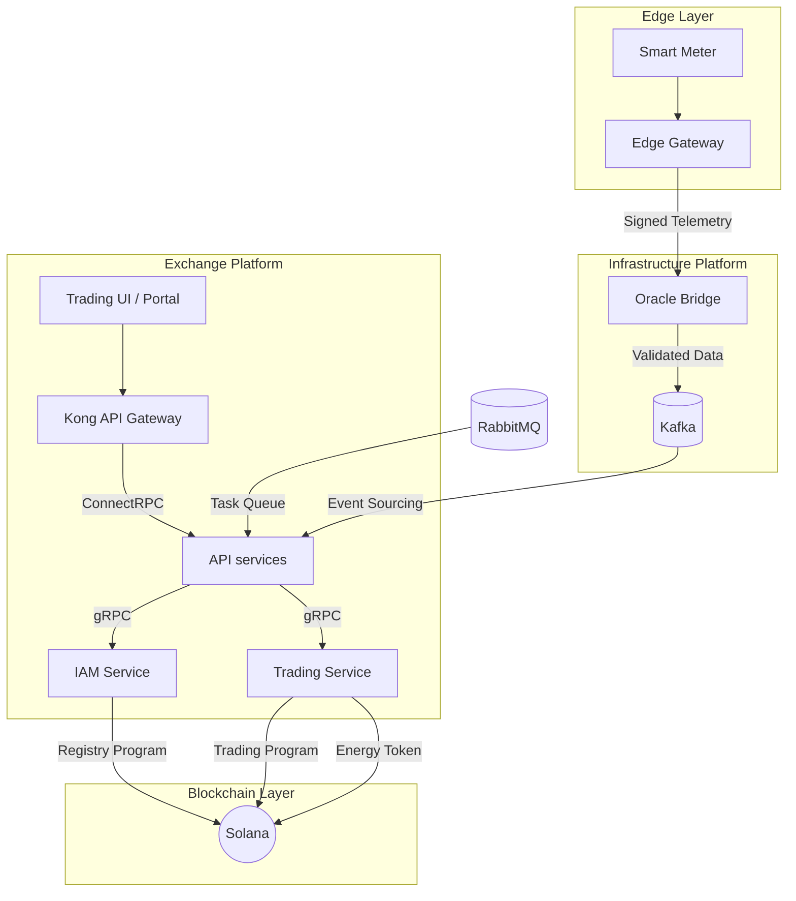

# GridTokenX Platform Overview

GridTokenX is a decentralized energy trading ecosystem that enables P2P energy exchange using the Solana blockchain for trustless settlement and a specialized IoT infrastructure for real-time telemetry validation.

## Architecture

The platform follows a **decentralized microservices architecture** where each service owns its domain and blockchain interactions.



### Key Technical Pillars
- **Solana Blockchain**: Anchor-based smart contracts for matching and settlement.
- **OrbStack**: Required high-performance Docker runtime for macOS.
- **ConnectRPC**: Modern gRPC-over-HTTP/2 communication between services.
- **Hybrid Messaging**: Kafka (event sourcing), RabbitMQ (task queues), and Redis (real-time).

## Project Structure

| Directory | Component | Responsibility |
|-----------|-----------|----------------|
| `gridtokenx-api/` | API Services | Orchestration, ConnectRPC Gateway, Background workers |
| `gridtokenx-iam-service/` | IAM Service | User Identity, Wallet Encryption, Registry Program |
| `gridtokenx-trading-service/` | Trading Service | Matching Engine, CDA/Batch, Trading Program |
| `gridtokenx-oracle-bridge/` | Oracle Bridge | Telemetry Validation (Ed25519), Kafka Ingestion |
| `gridtokenx-anchor/` | Smart Contracts | Anchor Programs (Registry, Trading, Energy Token) |
| `gridtokenx-edge-gateway/` | Edge Gateway | IoT Protocol Translation (DLMS, HPLC, OCPP) |
| `gridtokenx-trading/` | Trading UI | User-facing dashboard (Next.js) |
| `gridtokenx-smartmeter-simulator/`| Simulator | Stress testing & IoT hardware simulation |

## Service Landscape

| Service | Port | Endpoint / URL |
|---------|------|----------------|
| **API services** | 4000 | http://localhost:4000 |
| **Kong Gateway** | 8000 | http://localhost:8000 |
| **Trading UI** | 3000 | http://localhost:3000 |
| **Portal** | 3001 | http://localhost:3001 |
| **Explorer** | 3002 | http://localhost:3002 |
| **PostgreSQL** | 5434 | localhost:5434 |
| **Redis** | 6379 | localhost:6379 |
| **Kafka** | 9092 | localhost:9092 |
| **Grafana** | 3001 | http://localhost:3001 (Shared with Portal?) |
| **Solana RPC** | 8899 | http://localhost:8899 |

> [!NOTE]
> Portraits and URLs may vary based on your local `.env` configuration. Use `./scripts/app.sh status` to verify active services.

## Management Tools

### Unified Manager (`app.sh`)
```bash
./scripts/app.sh doctor    # Diagnostic check
./scripts/app.sh start     # Launch everything
./scripts/app.sh status    # Check health
./scripts/app.sh init      # Bootstrap blockchain
```

## Related Workflows

- [Environment Setup](./environment-setup.md) - Install prerequisites
- [Start Development](./start-dev.md) - Launch the platform
- [Testing](./testing.md) - Run verification suites
- [API Development](./api-development.md) - Service implementation
