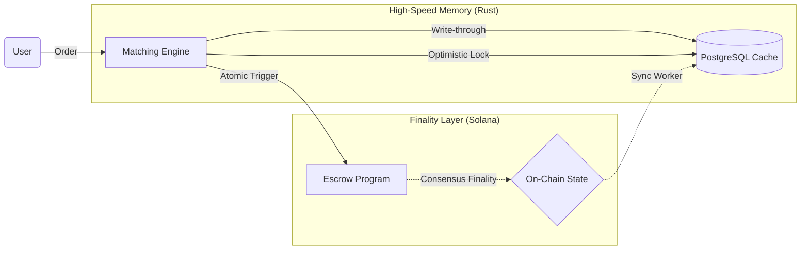
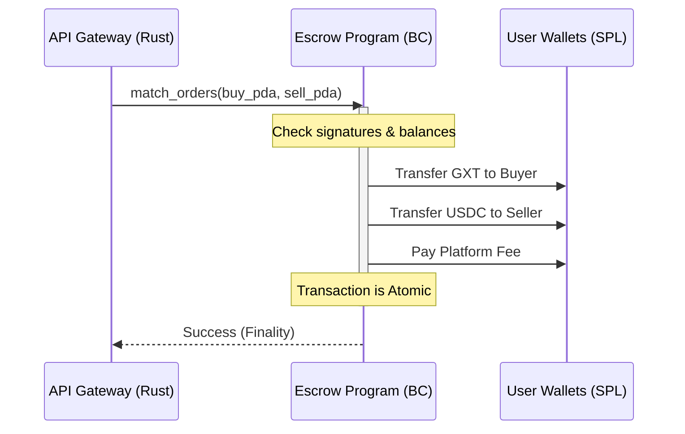

# GridTokenX: Final Presentation Strategy Guide
**Senior Computer Engineering Capstone**

To move from a "Mid-Term Implementation" to a "Final Engineering Triumph," your presentation should focus on **Optimization**, **Robustness**, and **Systemic Innovation**.

---

## 1. Mathematical Foundation (The "Engineering" Heart)

To impress a committee, you must formalize your logic. Include these equations on your slides:

### A. The Landed Cost Equation
Explain how you calculate the competitive price for a trade between Zone A and Zone B.

$$P_{landed} = P_{base} \times (1 + \lambda_{transmission}) + C_{wheeling} + F_{platform}$$

*   **$P_{base}$**: The price set by the prosumer.
*   **$\lambda_{transmission}$**: The loss coefficient (e.g., 0.05 for 5% loss across zones).
*   **$C_{wheeling}$**: Fixed administrative cost for using the physical grid.
*   **$F_{platform}$**: Small transaction fee for GridTokenX sustainability.

### B. Oracle Verification Logic
The Oracle doesn't just pass data; it performs a **Validity Check**:

$$\Delta E_{verified} = \int_{t_0}^{t_1} P(t) dt \text{ where } P(t) \in [P_{min}, P_{max}]$$

*   Explain that your Rust code validates that telemetry power ($P$) falls within a physical "Reasonability Range" before minting GXT.

---

## 2. Advanced Architectural Diagrams

### A. The "Dual-State" Consistency Model
This diagram explains why you use both PostgreSQL and Solana.

### B. Transaction Atomicity Sequence
This is crucial for demonstrating security.

---

## 3. Advanced High-Performance Topics

### A. Non-Blocking I/O (The "Rust Advantage")
*   **Topic**: How you handle 10,000 meters.
*   **Talking Point**: "We utilize the **Tokio Select** macro and **MPSC (Multi-Producer, Single-Consumer)** channels. Telemetry ingestion never blocks the matching engine, ensuring that no market data is delayed by network I/O."

### B. Program Derived Addresses (PDA) Security
*   **Topic**: Permissionless vs. Permissioned access.
*   **Talking Point**: "By using PDAs, our smart contracts ensure that only the **Platform Authority** can trigger a settlement, but the funds are held by the **Blockchain Runtime**, not our server. This eliminates the 'Honey Pot' risk of traditional exchanges."

---

## 4. The "WOW" Factors for the Committee

| Feature | Why it excels |
| :--- | :--- |
| **Digital Twin Simulator** | Most projects use static JSON files. You built a **continuous generator** that models real physics. |
| **Real-time WebSockets** | Using WebSockets for order book updates isn't just for show; it's necessary for high-frequency price discovery. |
| **Automated RECs** | Renewable Energy Certificates (RECs) minted automatically via blockchain is a multi-billion dollar real-world opportunity. |

---

## 5. Suggested Final Slide: Future Research
*   **Topic 1**: Moving the matching engine to **ZK-STARKs** for verifiable off-chain matching.
*   **Topic 2**: **Dynamic Demand Response**: Automatically adjusting simulated meter consumption based on market price spikes.

---

## 6. Demonstration Flow (The "Power" Play)
1.  **The Pulse**: Start with the `Simulator` dashboard showing real-time curves.
2.  **The Insight**: Show the `Admin Portal` metrics reflecting that data.
3.  **The Trade**: Place a P2P order in the `Trading UI`.
4.  **The Proof**: Reveal the **Solana Explorer** (or logs) showing the atomic transfer of GXT tokens.
