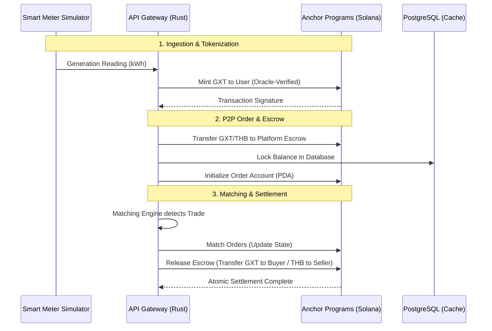

# GridTokenX: Integrated System Overview

GridTokenX is a decentralized peer-to-peer (P2P) energy exchange platform. It leverages blockchain technology to ensure transparency, security, and automated settlement of energy trades. The system is composed of four primary layers:

## 1. Blockchain Layer (Solana/Anchor)
Located in `gridtokenx-anchor/programs`, these smart contracts define the "Truth" of the system.

| Program              | Responsibility                                                                                                  |
| :------------------- | :-------------------------------------------------------------------------------------------------------------- |
| **Registry**         | Manages prosumer/consumer identities, meter registrations, and geographic zone assignments.                     |
| **Trading**          | Handles the P2P order book, escrow locking, and atomic settlement of matched trades.                            |
| **Energy Token**     | Implements the SPL Token-2022 standard for the "GXT" energy token, including minting and transfer logic.        |
| **Oracle**           | Ingests verified telemetry from smart meters, ensuring that energy generated is officially recognized on-chain. |
| **Governance**       | Manages platform parameters, fee structures, and decentralized decision-making.                                 |
| **Blockbench / TPC** | Technical benchmarking modules used for high-performance validation and academic metrics.                       |

## 2. Middleware Layer (API Gateway - Rust)
Located in `gridtokenx-apigateway`, this layer acts as the high-performance bridge between the outside world and the blockchain.
- **Abstraction**: Converts complex Solana instructions into simple REST/JSON-RPC and WebSocket APIs.
- **Fast Matching**: Executes an off-chain Order Matching Engine to identify trades in real-time, then triggers on-chain settlement.
- **Security**: Validates user signatures (Non-repudiation) before submitting transactions to the network.

## 3. Edge Layer (Smart Meter Simulator - IoT)
Located in `gridtokenx-smartmeter-simulator`, this provides the "Digital Twin" for real-world hardware.
- **Telemetry**: Generates synthetic generation/consumption data based on environmental models.
- **Integration**: Automatically pushes readings to the Oracle via the API Gateway to "Tokenize" energy production.

## 4. Application Layer (Frontend - React/Next.js)
Located in `gridtokenx-trading` and `gridtokenx-admin`.
- **User Interface**: Dashboard for prosumer activity tracking and market interaction.
- **Admin Portal**: System monitoring, revenue analytics, and zonal management.

---

## Token Lifecycle Operations (Mint, Burn, Transfer)

GridTokenX uses a dual-engine approach to manage assets, combining high-speed database locks with secure on-chain settlement.

### 1. Token Minting (Energy Generation)
- **Source**: Smart Meter Simulator sends telemetry (kWh).
- **Mechanism**: `BlockchainService` invokes the `Energy Token` program's `mint_tokens_direct`.
- **Result**: "GXT" tokens are minted into the producer's Associated Token Account (ATA) after the Oracle verifies the reading.

### 2. Escrow & Locking (Order Placement)
- **Buy Order**: API Gateway locks **Currency (THB)** in the user's ATA and transfers it to the **Platform Escrow ATA**.
- **Sell Order**: API Gateway locks **Energy (GXT)** in the prosumer's ATA and transfers it to the **Platform Escrow ATA**.
- **Audit**: Every lock is reflected in the PostgreSQL `escrow_records` table for real-time UI consistency.

### 3. Settlement & Transfer (Trade Execution)
- **Algorithm**: The Matching Engine identifies a price/time priority match.
- **Atomic Settlement**: The Gateway executes `release_escrow_to_seller` (THB) and `release_escrow_to_buyer` (GXT).
- **Landed Cost**: Settlement accounts for:
    - **Wheeling Charges**: Administrative transport fees.
    - **Transmission Losses**: Physical energy loss (only "effective energy" is delivered to the buyer).

### 4. Token Burning (Energy Consumption)
- **Source**: Negative telemetry from a consumer meter.
- **Mechanism**: API Gateway invokes `burn_tokens` on the `Energy Token` program.
- **Result**: GXT tokens are removed from the consumer's wallet, mirroring physical consumption and maintaining supply-demand integrity.

---

## Integrated Trading Lifecycle

### Key Engineering Concepts
1. **PDAs (Program Derived Addresses)**: Allow the system to programmatically derive account addresses for meters and orders without storing physical private keys in the Gateway.
2. **Atomic Settlement**: Uses Solana's transaction atomicity to ensure that energy is never transferred unless the payment is also transferred (No counterparty risk).
3. **Rust Concurrency**: Uses the Tokio async runtime to handle thousands of concurrent meter telemetry streams simultaneously.
