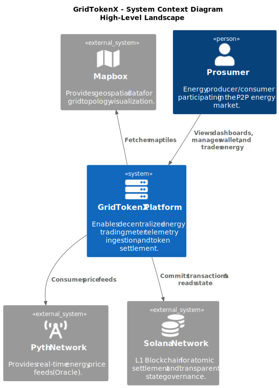

# GridTokenX Platform

A blockchain-powered P2P energy trading platform built on Solana with Anchor smart contracts.

## Architecture



## Components

| Component | Directory | Port (default) |
|-----------|-----------|----------------|
| API Gateway | `gridtokenx-apigateway/` (submodule) | 4000 (`APIGATEWAY_PORT`) |
| Trading UI | `gridtokenx-trading/` (submodule) | 3000 (`TRADING_PORT`) |
| Admin Portal | `gridtokenx-admin/` | 3000 (when run via `bun run dev`) |
| Anchor Dashboard | `anchor-dashboard/` | Vite dev server (IDL tooling) |
| Anchor Programs | `gridtokenx-anchor/` (submodule) | - |
| Smart Meter Simulator | `gridtokenx-smartmeter-simulator/` (submodule) | 8080 (`SMARTMETER_PORT`) |
| WASM Library | `gridtokenx-wasm/` | - |

Ports are configurable via `.env` when using Docker Compose.

## Quick Start

```bash
# Start full development environment (Validator, Docker, Relay, Frontend)
./dev-start.sh

# Stop all services
./scripts/stop-dev.sh
```

## Testing

### Anchor Tests
```bash
cd gridtokenx-anchor
anchor test --skip-build
```

### API Gateway Tests
```bash
cd gridtokenx-apigateway
cargo test --lib -- --test-threads=1
```

## Configuration

Key environment variables:

| Variable | Description | Default |
|----------|-------------|---------|
| `DATABASE_URL` | PostgreSQL connection | - |
| `REDIS_URL` | Redis connection | - |
| `SOLANA_RPC_URL` | Solana RPC endpoint | `http://localhost:8899` |
| `TOKENIZATION_USE_ONCHAIN_BALANCE` | Use on-chain balance for escrow | `false` |

Submodules: run `git submodule update --init --recursive` to fetch `gridtokenx-anchor`, `gridtokenx-apigateway`, `gridtokenx-smartmeter-simulator`, `gridtokenx-trading`, `gridtokenx-wasm`.

## Test Results

- **Anchor Programs**: 18/18 (100%)
- **API Gateway**: 117/117 (100%)

## License

Proprietary - GridTokenX
