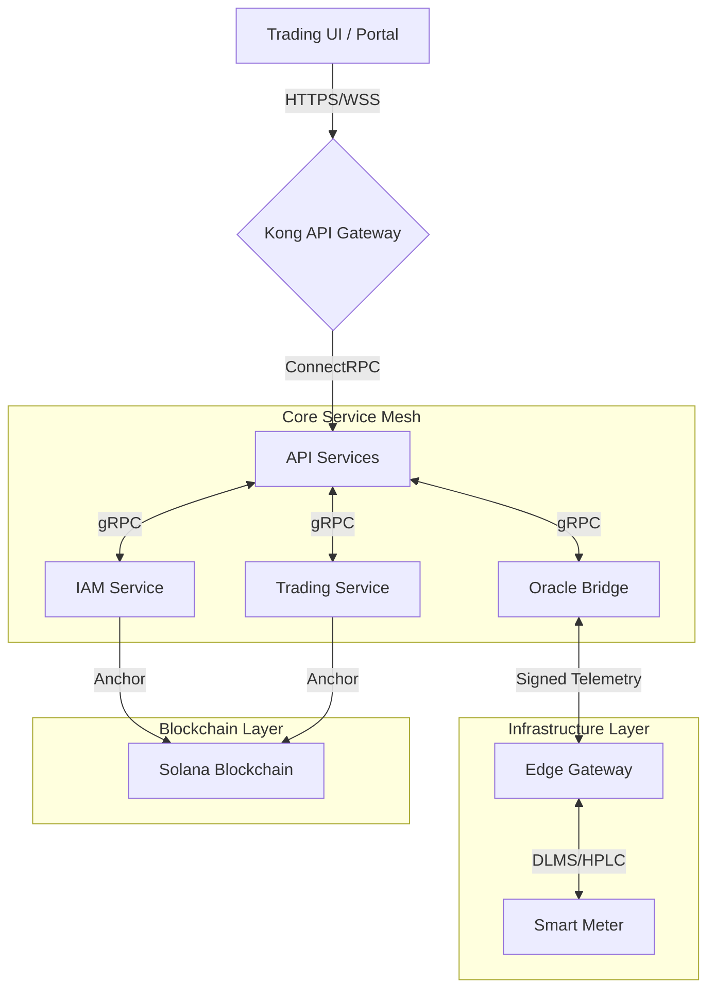

# ⚡️ GridTokenX Platform

[](https://gridtokenx.com)
[](https://solana.com)
[](LICENSE)

**GridTokenX** is a next-generation, blockchain-powered Peer-to-Peer (P2P) energy trading platform. It enables prosumers and consumers to trade energy directly, ensuring trustless settlement, high-performance telemetry ingestion, and decentralized grid stabilization.

---

## 🏛 Architecture at a Glance

GridTokenX follows a **Modern Microservices Architecture** orchestrated by a high-performance Rust gateway and secured by Solana smart contracts.


```mermaid
graph TD
    Client[Trading UI / Portal] -->|HTTPS/WSS| Kong{Kong API Gateway}
    Kong -->|ConnectRPC| APIS[API Services]
    
    subgraph "Core Service Mesh"
        APIS <-->|gRPC| IAM[IAM Service]
        APIS <-->|gRPC| Trading[Trading Service]
        APIS <-->|gRPC| OracleB[Oracle Bridge]
    end
    
    subgraph "Infrastructure Layer"
        OracleB <-->|Signed Telemetry| EdgeG[Edge Gateway]
        EdgeG <-->|DLMS/HPLC| Meter[Smart Meter]
    end
    
    subgraph "Blockchain Layer"
        IAM & Trading -->|Anchor| Solana[Solana Blockchain]
    end
```

### Key Platforms
1.  **Exchange Platform**: Financial layer handling order matching, trade execution, and on-chain settlement.
2.  **Infrastructure Platform**: Physical-to-digital bridge ensuring energy data integrity via cryptographic Edge IoT validation.

---

## 🛠 Technology Stack

-   **Backend Core**: Rust (Axum, Tonic, ConnectRPC)
-   **Blockchain**: Solana (Anchor Framework), SPL Token-2022
-   **Intelligence**: Sparse mixture of experts (MoE) for NILM (Edge AI)
-   **Messaging (Hybrid)**: 
    -   **Kafka**: Event sourcing & audit trails
    -   **RabbitMQ**: Task queues & guaranteed delivery
    -   **Redis**: Real-time matching & WebSockets
-   **Persistence**: PostgreSQL 17 (SQLx), InfluxDB (Time-series), Redis 7 (Cache)
-   **Infrastructure**: Kong Gateway, OrbStack (Docker Runtime)

---

## 🚀 Quick Start

### Prerequisites
-   **OrbStack**: Optimized Docker runtime for macOS.
-   **Rust Toolchain**: `rustup`, `cargo`.
-   **Solana CLI & Anchor**: For blockchain interaction.

### 1. Initialize the Platform
```bash
# Clone and setup submodules
git clone --recursive https://github.com/gridtokenx/platform.git
cd platform

# Start the unified infrastructure (Postgres, Redis, Kafka, Kong)
./scripts/app.sh start --docker-only

# Initialize the blockchain state and deploy programs
./scripts/app.sh init
```

### 2. Launch Services
We recommend the **Native Apps Mode** for the best development experience:
```bash
./scripts/app.sh start --native-apps
```

> [!TIP]
> Use `tail -f logs/*.log` to monitor background services in Native Mode.

---

## 📡 Service Registry

| Component | Endpoint | Role |
| :--- | :--- | :--- |
| **Kong Gateway** | `http://localhost:8000` | Unified Entry Point |
| **API Services** | `http://localhost:4000` | Lead Orchestrator |
| **IAM Service** | `grpc://localhost:50052` | Identity & Registry |
| **Trading Service** | `grpc://localhost:50053` | Matching & Settlement |
| **Oracle Bridge** | `http://localhost:4010` | IoT Data Ingestion |
| **Grafana** | `http://localhost:3001` | Observability (Admin/admin) |

---

## 🔗 On-Chain Program IDs (Localnet)

| Program | ID |
| :--- | :--- |
| **Registry** | `FmvDiFUWPrwXsqo7z7XnVniKbZDcz32U5HSDVwPug89c` |
| **Trading** | `69dGpKu9a8EZiZ7orgfTH6CoGj9DeQHHkHBF2exSr8na` |
| **Energy Token** | `n52aKuZwUeZAocpWqRZAJR4xFhQqAvaRE7Xepy2JBGk` |
| **Oracle** | `JDUVXMkeGi4oxLp8njBaGScAFaVBBg7iGoiqcY1LxKop` |
| **Governance** | `DamT9e1VqbA5nSyFZHExKwQu6qs4L5FW6dirWCK8YLd4` |

---

## 📖 Key Documentation

Detailed specifications are located in the `/docs` directory:

-   [Platform Design (Full Specification)](docs/PLATFORM_DESIGN.md)
-   [System Architecture & Diagrams](docs/architecture/specs/system-architecture.md)
-   [Academic Documentation (Thesis & Research)](docs/academic/README.md)
-   [Trading Service Deep Dive](docs/architecture/services/TRADING_SERVICE_ARCHITECTURE.md)
-   [IAM & Security Model](docs/architecture/services/IAM_SERVICE_ARCHITECTURE.md)
-   [Oracle Bridge & IoT Pipeline](docs/architecture/services/ORACLE_BRIDGE_ARCHITECTURE.md)

---

## ⚖️ License

Proprietary Software. © 2026 GridTokenX. All Rights Reserved.
