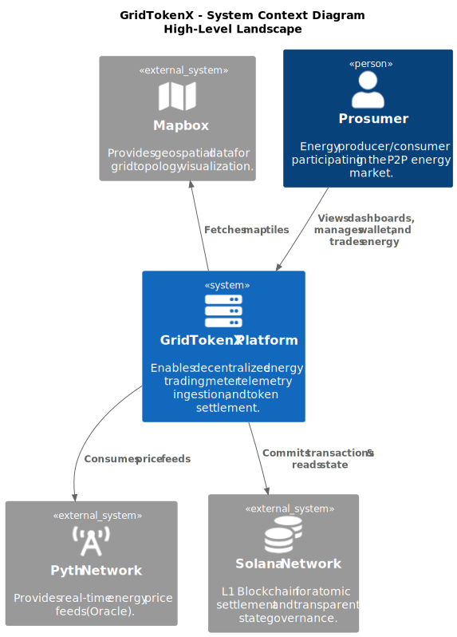

# GridTokenX Platform

A blockchain-powered P2P energy trading platform built on Solana with Anchor smart contracts.

## Architecture



## Technology Stack

- **Core**: Rust (Axum), TypeScript (Bun/Next.js), Python (FastAPI), Solana (Anchor)
- **Database**: PostgreSQL (Relational), InfluxDB (Time-series), Redis (Cache)
- **Messaging**: Kafka (Event Streaming)
- **Monitoring**: Prometheus, Grafana
- **Infrastructure**: OrbStack (Docker Runtime), Docker Compose

## Components

### Application Services

| Component | Directory | Port(s) |
|-----------|-----------|---------|
| **API Gateway** | `gridtokenx-api/` | 4000 (HTTP) |
| **IAM Service** | `gridtokenx-iam-service/` | 4002 (HTTP) / 4012 (gRPC) |
| **Trading Service** | `gridtokenx-trading-service/` | 8092 (HTTP) / 8093 (gRPC) |
| **Oracle Bridge** | `gridtokenx-oracle-bridge/` | 4010 (IoT Gateway) |
| **Trading UI** | `gridtokenx-trading/` | 3000 (Next.js) |
| **Smart Meter Simulator** | `gridtokenx-smartmeter-simulator/` | 8082 (API) |
| **Smart Meter UI** | `gridtokenx-smartmeter-simulator/ui` | 5173 (React/Vite) |
| **Anchor Programs** | `gridtokenx-anchor/` | RPC: 8899 / WS: 8900 |
| **WASM Library** | `gridtokenx-wasm/` | Shared logic |

### Infrastructure

| Component | Port(s) | Purpose |
|-----------|---------|---------|
| **PostgreSQL** | 5434 (Primary) / 5433 (Replica) | Relational Database |
| **Redis** | 6379 (Primary) / 6380 (Replica) | Cache |
| **InfluxDB** | 8086 | Time-Series Database |
| **Kafka** | 9092 (Internal) / 29092 (External) | Event Streaming |
| **Kong** | 8001 (Admin API) | API Gateway |
| **Prometheus** | 9090 | Metrics Collection |
| **Grafana** | 3001 | Visualization |
| **Loki** | 3100 | Log Aggregation |
| **Tempo** | 3200 | Tracing Backend |
| **OTEL Collector** | 4317 (gRPC) / 4318 (HTTP) | Telemetry Ingestion |
| **Mailpit** | 8025 (Web) / 1025 (SMTP) | Email Testing |
| **Node Exporter** | 9100 | Host Metrics |
| **cAdvisor** | 9082 | Container Metrics |
| **PostgreSQL Exporter** | 9187 | Database Metrics |
| **Redis Exporter** | 9121 | Cache Metrics |
| **Kafka Exporter** | 9308 | Broker Metrics |

## Management Tools

GridTokenX provides several tools to manage the development environment:

### 1. Unified Management Script (`app.sh`)
The recommended way to start and stop the entire platform.
```bash
./scripts/app.sh start                  # Start all services
./scripts/app.sh start --native-apps    # Docker infra + native background services (recommended for dev)
./scripts/app.sh start --skip-ui        # Backend services only
./scripts/app.sh start --docker-only    # Infrastructure only (PostgreSQL, Redis, Kafka)
./scripts/app.sh stop                   # Stop all services
./scripts/app.sh status                 # Check service and endpoint status
./scripts/app.sh init                   # Initialize blockchain and deploy programs
```

**Running Modes:**
- **Default** (`start`): Docker infrastructure + app services in terminal windows
- **Native Apps** (`start --native-apps`): Docker infrastructure + app services as background processes with log files
- **Docker Only** (`start --docker-only`): Only infrastructure containers
- **Skip UI** (`start --skip-ui`): Backend services without frontend applications

> 📖 **See also**: [Native Apps Mode Guide](docs/native-apps-mode.md) | [Quick Reference](docs/QUICK_REF_NATIVE_APPS.md)

### 2. Task Runner (`just`)
For common development tasks like testing and migrations.
```bash
just test                 # Run all tests
just migrate              # Run database migrations
just db-up / db-down      # Toggle database containers
just clippy               # Run lint checks
```

### 3. Shell Helper (`grx.nu`)
For Nushell users, providing similar functionality to `just`.

## Quick Start

### Prerequisites

**OrbStack Required**: GridTokenX uses [OrbStack](https://orbstack.dev/) as its Docker runtime for better performance and battery life on macOS.

```bash
# Install OrbStack (if not already installed)
brew install --cask orbstack

# Start OrbStack
open -a OrbStack
```

> 📖 **Migrating from Docker Desktop?** See [OrbStack Migration Guide](docs/ORBSTACK_MIGRATION.md)

1. **Clone & Fetch Submodules**:
   ```bash
   git clone <repo-url>
   cd gridtokenx-platform-infa
   git submodule update --init --recursive
   ```

2. **Setup Environment**:
   ```bash
   cp .env.example .env
   # Edit .env if needed
   ```

3. **Launch Platform**:
   ```bash
   ./scripts/app.sh start
   ```

## Testing

### Anchor Tests
```bash
cd gridtokenx-anchor
anchor test --skip-build
```

### API Gateway Tests
```bash
just test
```

## Monitoring

Once the platform is running, you can access monitoring tools:
- **Grafana**: [http://localhost:3001](http://localhost:3001) (Admin/admin)
- **Prometheus**: [http://localhost:9090](http://localhost:9090)
- **Mailpit**: [http://localhost:8025](http://localhost:8025)

## License

Proprietary - GridTokenX
