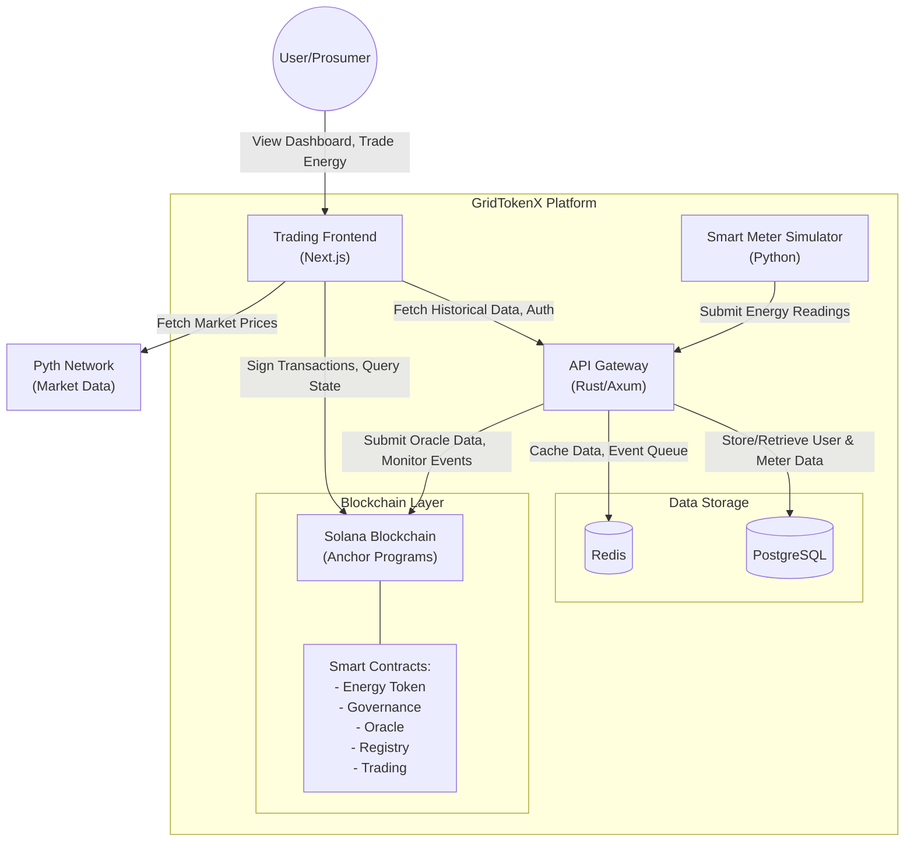

# GridTokenX System Context Diagram

```mermaid
graph TD
    %% Actors
    User(("User/Prosumer"))

    %% External Systems
    Pyth["Pyth Network<br/>(Market Data)"]

    %% Systems
    subgraph "GridTokenX Platform"
        Frontend["Trading Frontend<br/>(Next.js)"]
        Gateway["API Gateway<br/>(Rust/Axum)"]
        Simulator["Smart Meter Simulator<br/>(Python)"]
        
        subgraph "Data Storage"
            DB[("PostgreSQL")]
            Cache[("Redis")]
        end
        
        subgraph "Blockchain Layer"
            Solana["Solana Blockchain<br/>(Anchor Programs)"]
            Programs["Smart Contracts:<br/>- Energy Token<br/>- Governance<br/>- Oracle<br/>- Registry<br/>- Trading"]
            Solana --- Programs
        end
    end

    %% Relationships
    User -->|View Dashboard, Trade Energy| Frontend
    
    Frontend -->|Fetch Historical Data, Auth| Gateway
    Frontend -->|Sign Transactions, Query State| Solana
    Frontend -->|Fetch Market Prices| Pyth
    
    Simulator -->|Submit Energy Readings| Gateway
    
    Gateway -->|Store/Retrieve User & Meter Data| DB
    Gateway -->|Cache Data, Event Queue| Cache
    Gateway -->|Submit Oracle Data, Monitor Events| Solana
```
