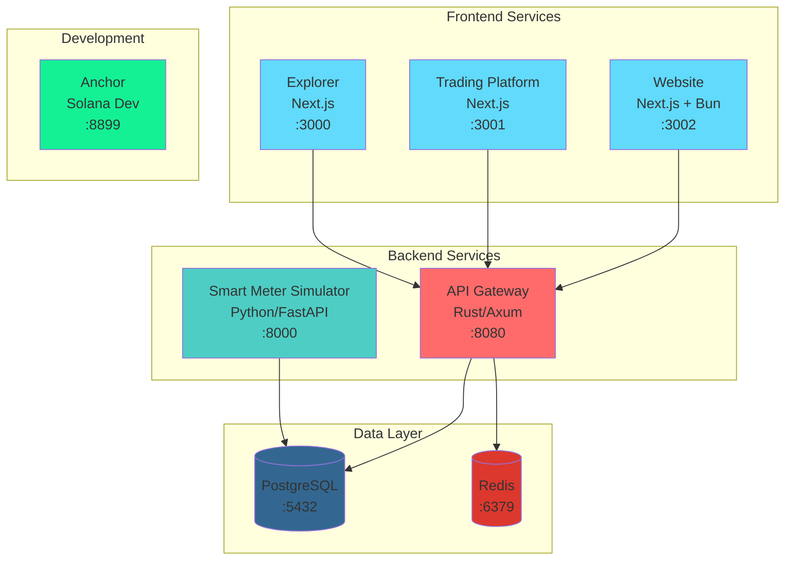

# Docker Configuration Walkthrough

## Overview

Successfully created comprehensive Docker and docker-compose configurations for the entire GridTokenX platform, enabling containerized deployment of all services.

## What Was Created

### Core Configuration Files

#### [docker-compose.yml](file:///Users/chanthawat/Developments/gridtokenx-platform/docker-compose.yml)
Main orchestration file for production deployment:
- **8 services** configured: PostgreSQL, Redis, API Gateway, Explorer, Trading, Website, Smart Meter Simulator, and Anchor (commented out)
- **Health checks** for all critical services
- **Service dependencies** properly configured
- **Shared network** (`gridtokenx-network`) for inter-service communication
- **Persistent volumes** for PostgreSQL and Redis data
- **Environment variable** support via `.env` file

#### [docker-compose.dev.yml](file:///Users/chanthawat/Developments/gridtokenx-platform/docker-compose.dev.yml)
Development override configuration:
- **Hot reload** enabled for all services
- **Source code mounted** as volumes for live development
- **Debug logging** enabled
- **Development commands** configured for each service

#### [.env.example](file:///Users/chanthawat/Developments/gridtokenx-platform/.env.example)
Environment variable template with:
- Database credentials
- JWT secrets
- Solana RPC URLs
- API endpoints
- Optional Kafka and InfluxDB configuration

### Service-Specific Dockerfiles

#### [gridtokenx-anchor/Dockerfile](file:///Users/chanthawat/Developments/gridtokenx-platform/gridtokenx-anchor/Dockerfile)
Multi-stage build for Solana Anchor development:
- Base image with Node.js 20 and pnpm
- Solana CLI and Anchor CLI installation
- Optimized dependency caching
- Support for running tests

#### [gridtokenx-apigateway/Dockerfile](file:///Users/chanthawat/Developments/gridtokenx-platform/gridtokenx-apigateway/Dockerfile)
Optimized Rust build with cargo-chef:
- **Multi-stage build** for minimal final image
- **Dependency caching** layer for faster rebuilds
- **Security hardened** with non-root user
- **Health check** endpoint configured
- Final image size optimized with debian-slim

### Documentation

#### [docker/README.md](file:///Users/chanthawat/Developments/gridtokenx-platform/docker/README.md)
Comprehensive 400+ line guide covering:
- Quick start instructions
- Architecture overview with service descriptions
- Development and production workflows
- Troubleshooting common issues
- Security best practices
- Database backup/restore procedures
- Advanced configuration options

#### [Makefile](file:///Users/chanthawat/Developments/gridtokenx-platform/Makefile)
Convenience commands for Docker management:
- `make build` - Build all images
- `make up` / `make prod` - Start production services
- `make dev` - Start development services with hot reload
- `make logs` - View all logs
- `make clean` - Clean up containers and volumes
- Service-specific commands (e.g., `make logs-explorer`)
- Database backup/restore commands
- Health check and stats monitoring

### Docker Ignore Files

Created `.dockerignore` files for all services:
- [gridtokenx-anchor/.dockerignore](file:///Users/chanthawat/Developments/gridtokenx-platform/gridtokenx-anchor/.dockerignore)
- [gridtokenx-apigateway/.dockerignore](file:///Users/chanthawat/Developments/gridtokenx-platform/gridtokenx-apigateway/.dockerignore)
- [gridtokenx-explorer/.dockerignore](file:///Users/chanthawat/Developments/gridtokenx-platform/gridtokenx-explorer/.dockerignore)
- [gridtokenx-trading/.dockerignore](file:///Users/chanthawat/Developments/gridtokenx-platform/gridtokenx-trading/.dockerignore)
- [gridtokenx-website/.dockerignore](file:///Users/chanthawat/Developments/gridtokenx-platform/gridtokenx-website/.dockerignore)
- [gridtokenx-smartmeter-simulator/.dockerignore](file:///Users/chanthawat/Developments/gridtokenx-platform/gridtokenx-smartmeter-simulator/.dockerignore)
- [.dockerignore](file:///Users/chanthawat/Developments/gridtokenx-platform/.dockerignore) (root level)

Each excludes unnecessary files like `node_modules`, `.git`, logs, and IDE configurations.

## Service Architecture



## Port Assignments

| Service | Internal Port | External Port | Protocol |
|---------|--------------|---------------|----------|
| Explorer | 4000 | 3000 | HTTP |
| Trading | 3000 | 3001 | HTTP |
| Website | 3000 | 3002 | HTTP |
| API Gateway | 8080 | 8080 | HTTP |
| Smart Meter | 8000 | 8000 | HTTP |
| PostgreSQL | 5432 | 5432 | TCP |
| Redis | 6379 | 6379 | TCP |
| Anchor (optional) | 8899, 8900 | 8899, 8900 | HTTP/WS |

## Validation Results

### Configuration Validation

Ran `docker-compose config --quiet` successfully with no errors:
- ✅ All service definitions valid
- ✅ Network configuration correct
- ✅ Volume mounts properly configured
- ✅ Environment variable interpolation working
- ✅ Service dependencies correctly defined

### Key Features Implemented

1. **Health Checks**
   - PostgreSQL: `pg_isready` check every 10s
   - Redis: `redis-cli ping` check every 10s
   - API Gateway: HTTP health endpoint check
   - All services have proper retry and timeout configurations

2. **Service Dependencies**
   - API Gateway waits for PostgreSQL and Redis to be healthy
   - Smart Meter Simulator waits for PostgreSQL
   - Prevents startup race conditions

3. **Environment Management**
   - Centralized `.env` file for all configuration
   - Sensible defaults for development
   - Clear documentation in `.env.example`

4. **Development Workflow**
   - Hot reload for all frontend services
   - Source code mounted for live editing
   - Debug logging enabled
   - Faster iteration cycles

5. **Production Optimization**
   - Multi-stage builds for minimal image sizes
   - Non-root users for security
   - Health checks for reliability
   - Restart policies configured

## Quick Start Guide

### First Time Setup

```bash
# 1. Navigate to project directory
cd /Users/chanthawat/Developments/gridtokenx-platform

# 2. Create environment file
cp .env.example .env

# 3. Edit .env with your configuration
# Set POSTGRES_PASSWORD, JWT_SECRET, etc.

# 4. Build all services
docker-compose build

# 5. Start all services
docker-compose up -d

# 6. Check service status
docker-compose ps

# 7. View logs
docker-compose logs -f
```

### Using Make Commands

```bash
# Setup environment
make setup-env

# Build all services
make build

# Start production services
make up

# Start development services with hot reload
make dev

# View logs
make logs

# Check health
make health

# Stop all services
make down

# Clean up (removes volumes)
make clean
```

### Accessing Services

Once all services are running:

- **Explorer**: http://localhost:3000
- **Trading Platform**: http://localhost:3001  
- **Website**: http://localhost:3002
- **API Gateway**: http://localhost:8080
- **Smart Meter API Docs**: http://localhost:8000/docs

## Technology Stack Summary

| Service | Language/Framework | Package Manager | Build Tool |
|---------|-------------------|-----------------|------------|
| Explorer | TypeScript/Next.js | npm/bun | Next.js |
| Trading | TypeScript/Next.js | npm | Next.js |
| Website | TypeScript/Next.js | bun | Next.js |
| API Gateway | Rust | cargo | cargo |
| Smart Meter | Python | pip | uvicorn |
| Anchor | TypeScript/Rust | pnpm | Anchor CLI |

## Next Steps

### Before Production Deployment

1. **Security Hardening**
   - Change all default passwords in `.env`
   - Use strong JWT secrets (32+ characters)
   - Set up HTTPS with reverse proxy
   - Restrict database port exposure

2. **Monitoring Setup**
   - Configure log aggregation
   - Set up metrics collection
   - Implement alerting

3. **Backup Strategy**
   - Schedule automated database backups
   - Test restore procedures
   - Document disaster recovery plan

4. **Performance Tuning**
   - Adjust resource limits
   - Configure connection pools
   - Optimize cache settings

### Development Workflow

1. **Local Development**
   ```bash
   make dev  # Start with hot reload
   ```

2. **Testing Changes**
   ```bash
   make build-<service>  # Rebuild specific service
   make restart-<service>  # Restart to test
   ```

3. **Viewing Logs**
   ```bash
   make logs-<service>  # Service-specific logs
   ```

4. **Database Management**
   ```bash
   make backup-db  # Create backup
   make restore-db FILE=backup.sql  # Restore
   ```

## Files Created Summary

- ✅ 2 Dockerfiles (anchor, apigateway - others existed)
- ✅ 7 .dockerignore files (all services + root)
- ✅ 1 docker-compose.yml (production)
- ✅ 1 docker-compose.dev.yml (development)
- ✅ 1 .env.example (environment template)
- ✅ 1 Makefile (convenience commands)
- ✅ 1 docker/README.md (comprehensive documentation)

**Total: 14 new files created**

## Conclusion

The GridTokenX platform now has a complete, production-ready Docker configuration that:
- Supports both development and production workflows
- Includes all necessary services and dependencies
- Provides comprehensive documentation
- Follows Docker and security best practices
- Enables easy deployment and scaling

All configurations have been validated and are ready to use. Simply copy `.env.example` to `.env`, configure your values, and run `make up` to start the entire platform.
