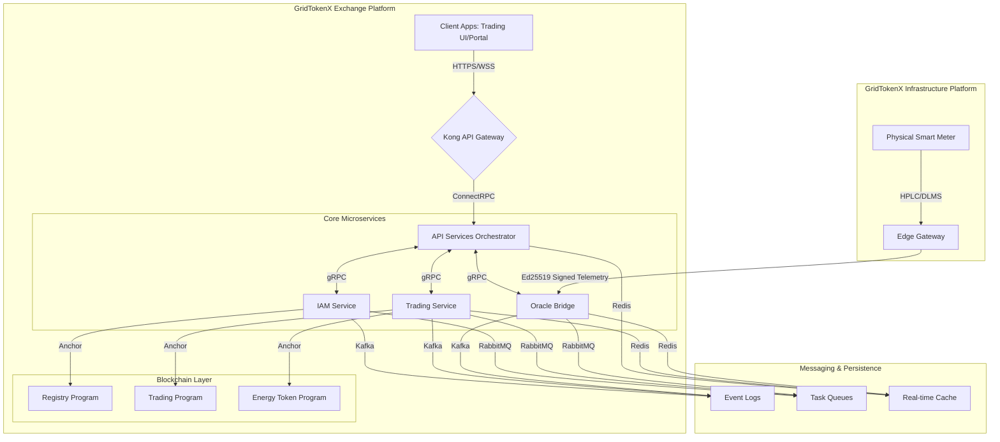

# 💠 GridTokenX Platform Design (Microservices)

**Version**: 2.2  
**Active Since**: April 10, 2026  
**Status**: ✅ Production Ready / Source of Truth

---

## 1. Executive Summary

GridTokenX is architected as **two distinct but interconnected platforms**, bridging physical energy infrastructure with trustless financial markets on the Solana blockchain.

### 🏛 GridTokenX Exchange Platform
A blockchain-powered energy trading exchange. It handles order book management, real-time matching, trade execution, user identity (KYC), and token economics. All financial settlement occurs on-chain via Anchor smart contracts.

### 📡 GridTokenX Infrastructure Platform
A physical-to-digital bridge connecting real-world assets (Smart Meters, EV Chargers) to the digital market. It handles high-throughput telemetry ingestion, cryptographic validation (Ed25519), settlement window aggregation, and NILM (Non-Intrusive Load Monitoring).

---

## 2. Platform Architecture

GridTokenX utilizes a **Microservices-based Orchestration** model. Access is managed via the Kong API Gateway, while core services communicate using the high-performance ConnectRPC protocol.

### Platform Boundaries

| Aspect | Exchange Platform | Infrastructure Platform |
| :--- | :--- | :--- |
| **Primary Domain** | Financial / Trading | Physical / Data Integrity |
| **Blockchain Access** | ✅ Direct (IAM, Trading) | ❌ Indirect (signs only) |
| **Data Direction** | Receives validated data | Produces validated data |
| **Scaling Factor** | Trading volume / User count | Device count / Telemetry volume |
| **Key Services** | API Gateway, IAM, Trading | Edge Gateway, Oracle Bridge |

---

## 3. Core Service Mesh

### 3.1 API Services (`gridtokenx-api`)
The **Lead Orchestrator**. It manages gRPC communication with all microservices, handles Redis-based real-time broadcasting, and executes background persistence tasks.

-   **Tech**: Rust (Axum), ConnectRPC
-   **Port**: 4000
-   **Role**: Verifies JWTs from Kong, aggregates service responses, and manages the `Persistence Worker` for high-throughput telemetry (20k+ readings/sec).

### 3.2 IAM Service (`gridtokenx-iam-service`)
The **Identity Guardian**. It owns user registration, KYC workflows, and secure wallet custody.

-   **Tech**: Rust (Tonic), AES-256-GCM
-   **Role**: Generates and encrypts user wallets. Manages the **Registry Program** on-chain.
-   **Security**: Private keys are encrypted using a `MASTER_SECRET` and never stored in plain text.

### 3.3 Trading Service (`gridtokenx-trading-service`)
The **Matching Engine**. It manages liquidity and settles trades on-chain.

-   **Tech**: Rust (Tonic), In-memory Order Book + Redis
-   **Role**: Executes Continuous Double Auction (CDA) and Batch Matching. Manages **Trading & Energy Token Programs**.

### 3.4 Oracle Bridge (`gridtokenx-oracle-bridge`)
The **Cryptographic Trust Layer**. It validates incoming telemetry from the Infrastructure Platform.

-   **Tech**: Rust (Axum/Tonic), Kafka, RabbitMQ
-   **Role**: Verifies Ed25519 signatures from Edge Gateways, performs zone-based partitioning, and aggregates 15-minute settlement windows.

---

## 4. Secure Telemetry Pipeline

GridTokenX ensures **Physical-to-Digital Integrity** through a multi-stage validation pipeline:

1.  **Edge Sensing**: Smart Meters pull power data via DLMS/COSEM.
2.  **Cryptographic Signing**: The Edge Gateway signs telemetry with a hardware-bound Ed25519 key.
3.  **Bridge Validation**: The Oracle Bridge verifies the signature against the **Registry Program** on-chain.
4.  **Anomaly Detection**: Range checks (kWh, Voltage, Frequency) prevent spoofing.
5.  **Event Sourcing**: Validated data is published to **Kafka** for immutable logging and **InfluxDB** for observability.

---

## 5. Token Economic Model (Tri-Token System)

GridTokenX utilizes a sophisticated three-token model to balance utility, governance, and stable payment.

| Token | Character | Standard | Purpose |
| :--- | :--- | :--- | :--- |
| **GRX** | Governance | SPL | Fixed supply (1B). Used for staking, DAO voting, and fee rewards. |
| **GRID** | Utility | SPL-2022 | Elastic supply. 1 kWh = 1 GRID. Minted by Oracle confirmation. |
| **USDC/THB** | Payment | SPL | Stable currencies used for trade settlement and fees. |

> [!TIP]
> **Deflationary Pressure**: 20% of all protocol fees are used to Buyback & Burn **GRX** tokens, ensuring long-term value accrual for stakers.

---

## 6. On-Chain Smart Contracts (Anchor)

The platform is powered by five core programs deployed on Solana:

| Program | Program ID | Primary Responsibility |
| :--- | :--- | :--- |
| **Registry** | `FmvDiFUWPrwXsqo7z7XnVniKbZDcz32U5HSDVwPug89c` | Identity, KYC, Meter Registration |
| **Trading** | `69dGpKu9a8EZiZ7orgfTH6CoGj9DeQHHkHBF2exSr8na` | Order Book, Escrow, Match Clearing |
| **Energy Token** | `n52aKuZwUeZAocpWqRZAJR4xFhQqAvaRE7Xepy2JBGk` | GRID Token Mint/Burn logic |
| **Oracle** | `JDUVXMkeGi4oxLp8njBaGScAFaVBBg7iGoiqcY1LxKop` | Telemetry verification, Price Feeds |
| **Governance** | `DamT9e1VqbA5nSyFZHExKwQu6qs4L5FW6dirWCK8YLd4` | Protocol parameters, DAO Proposals |

---

## 7. Security Architecture

### 🛡 Zero-Trust Custody
User private keys are **never stored in plain text**. They are encrypted using `WalletService` during generation and only decrypted in-memory by the IAM service for signing authorized transactions.

### ⛓ Cryptographic Chain of Trust
-   **Edge**: Ed25519 hardware-bound signing.
-   **Transport**: mTLS for service-to-service communication.
-   **API**: Scoped JWTs validated at the Kong Gateway.
-   **On-Chain**: Program-enforced logic prevents double-spending or unauthorized minting.

---

## 8. Scaling & Performance Targets

GridTokenX is designed for global scale:

-   **Matching Latency**: < 10ms (In-memory Engine).
-   **Settlement Finality**: ~400ms (Solana).
-   **Telemetry Throughput**: 100k+ readings/sec via Kafka partitioned workers.
-   **Data Storage**: Hybrid strategy (Postgres for Metadata, InfluxDB for Metrics, Redis for State).

---

© 2026 GridTokenX. All Rights Reserved.
