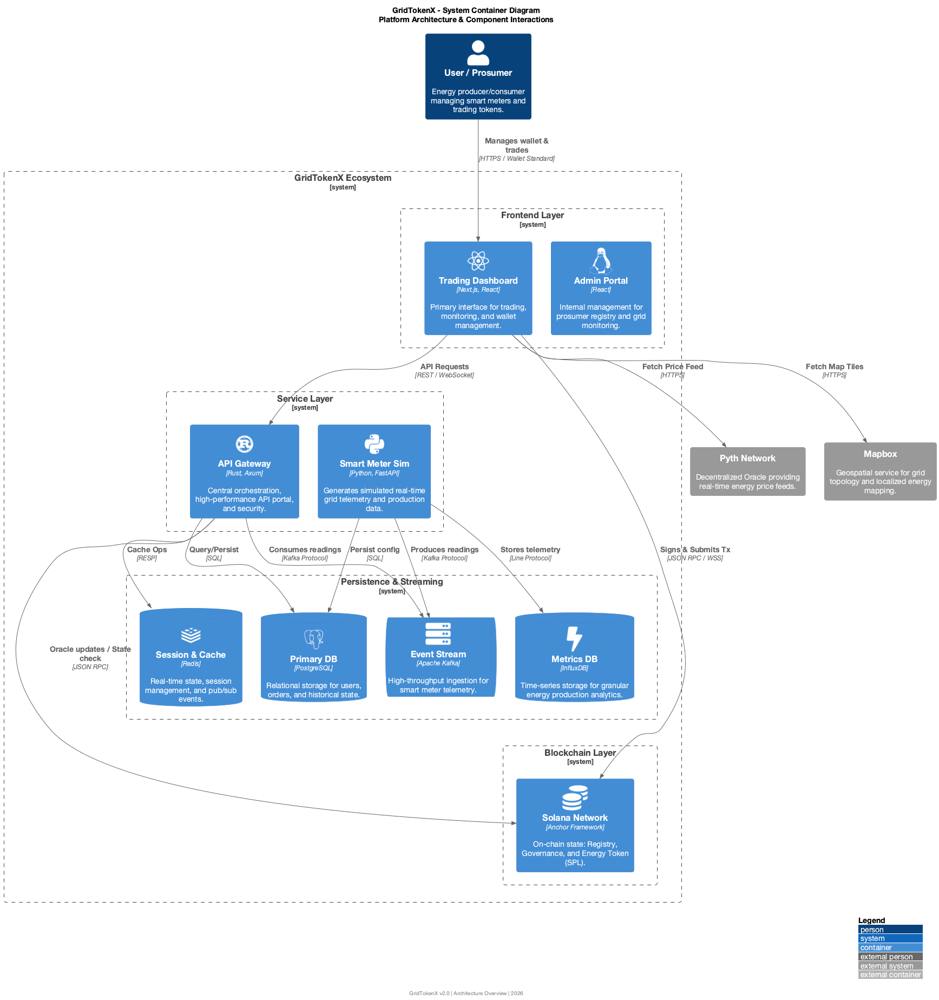

# GridTokenX Protocols & Architecture

This document tracks all external and internal protocols used across the GridTokenX platform services.

## System Architecture Diagram

## Detailed Architecture Diagrams

We interpret specific views of the system architecture by layer:

- **Full Protocols Overview**: [View High-Res](architecture/architecture_protocols.png)
- **Frontend Layer**: [View Diagram](architecture/architecture_frontend.png)
- **Backend Layer**: [View Diagram](architecture/architecture_protocols.png)
- **Simulator & Data Layer**: [View Diagram](architecture/architecture_simulator.png)
- **Blockchain Layer**: [View Diagram](architecture/architecture_blockchain.png)

## Detailed Process Flows

- **Energy Token Minting**: [Sequence Diagram](minting-sequence-diagram.png)
- **P2P Trading Lifecycle**: [Sequence Diagram](trading-sequence-diagram.png)

## Detailed Protocols by Service

### 1. gridtokenx-apigateway (Rust/Backend)
*   **HTTP/1.1 & HTTP/2**: Core API transport via `axum` and `hyper` (server) and `reqwest` (client).
*   **WebSocket**: Real-time streaming for trading data via `axum`.
*   **PostgreSQL Wire Protocol**: Database communication via `sqlx`.
*   **Redis Protocol (RESP)**: Caching and pub/sub via `redis`.
*   **Kafka Protocol**: Consuming meter readings from `meter-readings` topic via `rdkafka`.
*   **Solana JSON RPC**: Blockchain interaction via `solana-client`.
*   **Prometheus**: Metrics exposition via `metrics-exporter-prometheus`.
*   **SMTP**: Email delivery via `lettre`.

### 2. gridtokenx-trading (Frontend)
*   **HTTPS**: Client-server communication.
*   **Solana JSON RPC & WebSocket**: Direct blockchain connection via `@solana/web3.js` (account subscriptions, transaction submission).
*   **Wallet Standard**: Communication between dApp and browser wallets (Phantom, Solflare) via `@solana/wallet-adapter`.
*   **Pyth Network Protocol**: Real-time oracle price feeds via `@pythnetwork/client`.
*   **Mapbox Vector Tiles**: Grid topology rendering via `mapbox-gl`.

### 3. gridtokenx-smartmeter-simulator (Python)
*   **HTTP**: Simulator control API via `fastapi` / `uvicorn`.
*   **Kafka Protocol**: High-throughput event streaming for meter readings via `kafka-python`.
*   **InfluxDB Line Protocol**: Time-series metric ingestion via `influxdb-client`.
*   **WebSocket**: Real-time simulated data streaming via `websockets`.
*   **PostgreSQL**: State persistence via `psycopg2`.

### 4. gridtokenx-anchor (Smart Contracts)
*   **Solana Sealevel**: On-chain execution environment.
*   **SPL Token Standard**: Fungible token protocol (Energy Tokens, USDC).
*   **Anchor IDL**: JSON-based protocol for defining program interfaces.
*   **CPI (Cross-Program Invocation)**: Protocol for internal contract-to-contract calls.

### 5. gridtokenx-admin (Frontend)
*   **HTTPS**: REST API interactions via React Query.
