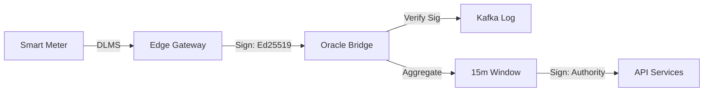

# 📡 Oracle Bridge Architecture

**Service Name**: `gridtokenx-oracle-bridge`  
**Ports**: `4010` (IoT Gateway) / `50051` (gRPC Context)  
**Version**: 2.2  
**Status**: ✅ Production Ready

---

## 1. Overview

The **Oracle Bridge** is the cryptographic trust layer between the physical world and the GridTokenX Exchange. It manages the ingestion of high-frequency energy telemetry from Edge Gateways, validates data integrity using Ed25519 signatures, and aggregates data into "Settlement Windows" for blockchain submission.

---

## 2. Core Responsibilities

1.  **Industrial Ingestion**: Receives telemetry via REST and gRPC from distributed Edge Gateways.
2.  **Cryptographic Validation**: Verifies Ed25519 signatures against the on-chain **Registry Program** (via IAM Service).
3.  **Zone-Based Partitioning**: Shards incoming data into 10 logical zones (default) for parallel processing and grid management.
4.  **Settlement Aggregation**: Buffers 15-minute windows of energy data, calculates net consumption/production, and signs the result with the **Oracle Authority Key**.
5.  **Neural NILM Engine**: Executes real-time load disaggregation using a **Sparse Mixture of Experts (MoE)** model to identify appliance-level consumption at the edge of the bridge.

---

## 3. Technical Stack

-   **Framework**: Rust (Axum for HTTP, Tonic for gRPC)
-   **Messaging**: 
    -   **Kafka**: High-throughput stream for raw telemetry (`meter.readings`).
    -   **RabbitMQ**: Task queue for settlement retry logic (`settlement.tasks`).
-   **Persistence**: Redis 7 (Snapshotting & Zone Buffers)
-   **Security**: Ed25519 Signature Verification, mTLS, HMAC API Keys.

---

## 4. Secure Telemetry Pipeline

GridTokenX implements a **Chain of Custody** for energy data:



### Validation Procedure
1.  **Extract**: Pull Ed25519 signature from `X-Edge-Signature` header.
2.  **Lookup**: Retrieve device's registered public key from the IAM Registry.
3.  **Check**: Ensure reading ranges (Voltage: 200-250V, Frequency: 49-51Hz) are within logical bounds.
4.  **Forward**: If valid, publish to Kafka; if invalid, drop and log for audit.

---

## 5. NILM (Non-Intrusive Load Monitoring)

The bridge utilizes **Sparse MoE (Mixture of Experts)** to perform edge intelligence:
-   **Expertise**: Individual neural "experts" trained on specific appliance signatures (AC, Water Pumps, EV Chargers).
-   **Efficiency**: Only relevant experts are activated per request, minimizing CPU overhead while maintaining high resolution.
-   **Output**: Produces a breakdown of *where* energy is being used, enabling targeted demand response.

---

## 6. Directory Structure

```text
gridtokenx-oracle-bridge/src/
├── main.rs              # Server Entry & Worker Spawning
├── ingester/            # Zone-based telemetry ingestion
├── aggregator/          # 15-minute settlement window logic
├── nilm/                # Neural Engine (Sparse MoE)
├── infra/               # Kafka/RabbitMQ/Redis producers
├── protocol/            # DLMS, SunSpec, and OpenADR handlers
└── middleware/          # Signature verification & rate limiting
```

---

## Related Documentation
-   [Grid Protocol Integration Guide](./ORACLE_BRIDGE_GRID_PROTOCOL.md)
-   [Platform Design](../../PLATFORM_DESIGN.md)
-   [System Architecture](../specs/system-architecture.md)
-   [Smart Contract Architecture](../specs/smart-contract-architecture.md#oracle-program)
