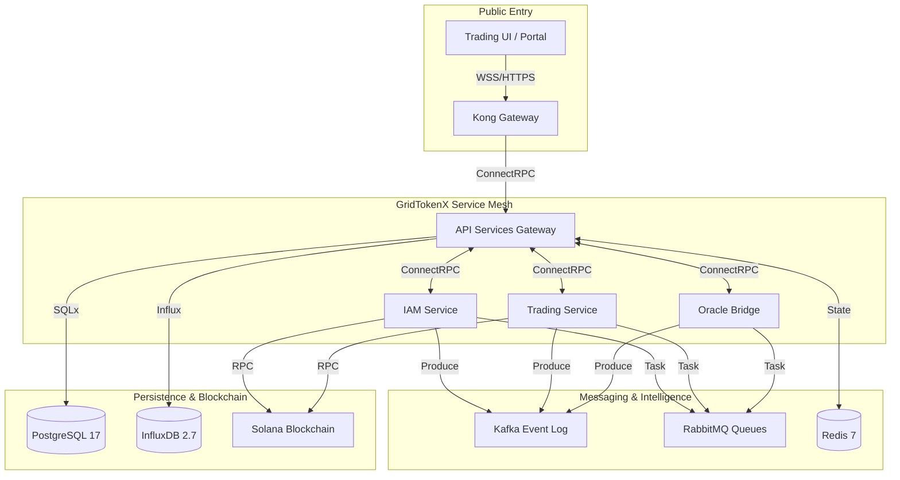

# 🧬 System Architecture Specification

**Version**: 2.2 (Microservices Standard)  
**Date**: April 10, 2026  
**Status**: ✅ Unified & Production-Ready

---

## 1. Overview

The GridTokenX Platform is a decentralized energy exchange system that integrates physical energy infrastructure (meters, solar inverters, EV chargers) with a trustless financial market on the **Solana** blockchain. It leverages a high-performance Rust-based microservices mesh to ensure scalability, data integrity, and low-latency matching.

---

## 2. Infrastructure Layer

GridTokenX utilizes **OrbStack** as the primary Docker runtime for macOS development, providing 2x faster networking and significant battery savings.

### 🛠 Tooling
-   `./scripts/app.sh`: Unified management for starting, stopping, and initializing the platform.
-   `just`: Task runner for database migrations, testing, and linting.
-   `ConnectRPC`: High-performance HTTP/2-based gRPC used for all internal service communication.

---

## 3. High-Level Architecture (C4 Level 2)

---

## 4. Hybrid Messaging Strategy

GridTokenX uses a multi-layered messaging architecture to balance durability, reliability, and real-time responsiveness.

| Technology | Role | Primary Use Case | Performance |
| :--- | :--- | :--- | :--- |
| **Kafka** | Event Sourced Log | Immutable telemetry history, audit trails, and multi-consumer events. | High Throughput |
| **RabbitMQ** | Reliable Task Queue | Guaranteed delivery for email notifications and settlement retries. | High Reliability |
| **Redis** | Real-time Hub | Sub-millisecond matching engine state and WebSocket broadcasting. | Ultra-Low Latency |

---

## 5. Technology Stack Summary

| Layer | Technology | Benchmarks |
| :--- | :--- | :--- |
| **Edge Gateway** | Rust / RPi Zero 2W | < 50ms local processing |
| **Gateway** | Kong Gateway 3.6+ | < 10ms Routing Overhead |
| **Backend** | Rust (Axum, Tonic) | ~30ms Total Logic Latency |
| **Matching** | In-memory + Redis Locks | ~5ms Internal Execution |
| **Blockchain** | Solana (Anchor) | ~400ms Confirmation (32 slots) |
| **Persistence** | PostgreSQL 17 (SQLx) | Sub-millisecond indexed queries |

---

## 6. Secure Telemetry Pipeline

1.  **Edge Sensing**: Physical meter pulls via DLMS.
2.  **Edge Signing**: Ed25519 signature applied at the physical source.
3.  **Oracle Validation**: The **Oracle Bridge** validates the signature against the **Registry Program** and performs zone-partitioning.
4.  **Kafka Streaming**: Data is logged to the `meter.readings` topic for high-throughput buffering.
5.  **Persistence Worker**: A multi-threaded worker in `api-services` consumes from Kafka/Redis and performs batch SQL inserts (handles 20k+ readings/sec).

---

## Related Documentation
-   [Blockchain Architecture](./blockchain-architecture.md)
-   [IAM Service Architecture](../services/IAM_SERVICE_ARCHITECTURE.md)
-   [Trading Service Architecture](../services/TRADING_SERVICE_ARCHITECTURE.md)
-   [Oracle Bridge Architecture](../services/ORACLE_BRIDGE_ARCHITECTURE.md)
