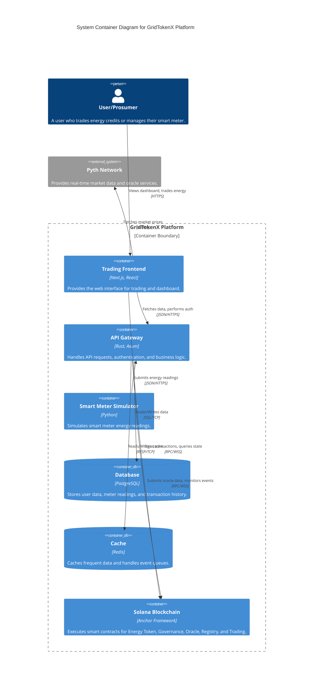

# GridTokenX System Container Diagram (Mermaid C4)

The PlantUML preview failed because it requires **Graphviz** to be installed on your system. Since I cannot install system dependencies, I have converted the C4 model to **Mermaid**, which renders natively in VS Code without extra setup.

