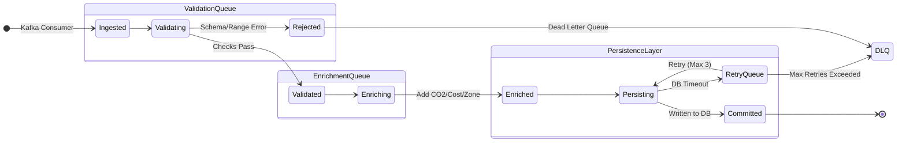

# Data Collection and Preprocessing Methodology
## GridTokenX Platform

---

## 1. Overview
The **GridTokenX** platform employs a high-fidelity simulation and ingestion pipeline to model realistic energy markets. This document details the end-to-end data flow, from physics-based generation to asynchronous processing and storage.

---

## 2. Data Generation (Simulation Layer)
**Component**: `gridtokenx-smartmeter-simulator`  
**Framework**: Python / FastAPI / Pandapower

The platform does not rely on random noise. Instead, it uses **Pandapower** to solve actual power flow equations.

### 2.1 Physics Engine Implementation
The core engine (`PhysicsSimulationEngine`) calculates voltage drops and line losses based on grid topology.

**Simulation Loop (Python):**
```python
import pandapower as pp
import pandapower.networks as pn

def step_simulation(self, timestamp):
    # 1. Initialize Base Network (e.g., standard rural grid)
    if self.net is None:
        self.net = pn.create_kerber_landnetz_freileitung_1()

    # 2. Update Loads from Meter Profiles
    for meter in self.active_meters:
        # Convert kW to MW for pandapower
        p_mw = meter.get_current_consumption(timestamp) / 1000.0
        # Update load at specific bus index
        self.net.load.at[meter.bus_idx, 'p_mw'] = p_mw

    # 3. Solve Power Flow (Newton-Raphson)
    try:
        pp.runpp(self.net, algorithm='nr', max_iteration=50)
    except pp.LoadflowNotConverged:
        self.handle_divergence()

    # 4. Extract Physics Metrics
    results = []
    for meter in self.active_meters:
        # Voltage in per-unit (p.u.)
        vm_pu = self.net.res_bus.vm_pu[meter.bus_idx]
        # Line loading percentage
        loading = self.net.res_line.loading_percent.max()
        
        results.append({
            "meter_id": meter.id,
            "voltage": vm_pu * 230.0, # Convert to Volts
            "grid_strain": loading
        })
    return results
```

---

## 3. Data Collection (Ingestion Layer)
**Component**: `gridtokenx-apigateway`  
**Protocol**: Apache Kafka (Streaming)

### 3.1 Streaming Architecture
The simulator (`smartmeter-simulator` in Docker) streams telemetry readings to **Kafka** topic `meter-readings`.

---

## 4. Preprocessing & Processing Strategy
**Component**: `gridtokenx-apigateway`  
**Mechanism**: Asynchronous Workers (Redis Queue)

### 4.1 Worker State Machine
Each reading flows through a strict state machine to ensure data integrity before persistence.



### 4.2 Processing Pipeline
Each reading undergoes a multi-stage validation and enrichment process:

**Stage 1: De-queue**
*   Worker pops a `ReadingTask` from Redis (`queue:meter_readings`).

**Stage 2: Validation**
*   **Serial Number Lookup**: Verifies meter exists in PostgreSQL.
*   **Anomaly Detection**:
    *   Voltage range: 200V - 260V.
    *   Frequency range: 49.5Hz - 50.5Hz.

**Stage 3: Enrichment**
*   **Surplus/Deficit Calculation**: `surplus = generation - consumption`.
*   **CO₂ Savings Estimation**: Based on grid emission factors (0.5 kgCO₂/kWh).

**Stage 4: Persistence**
*   **Hot Storage (Redis)**: Key `meter:{serial}:latest`; TTL 60s.
*   **Warm Storage (PostgreSQL)**: Permanent record in `meter_readings`.
*   **Cold Storage (InfluxDB)**: High-resolution metrics for analytics.

---

## 5. Data Lifecycle Management (Phase 7)

We implement a tiered approach to balance cost and performance:

| Tier | Storage | Content | Retention Policy | Purpose |
|------|---------|---------|------------------|---------|
| **Hot** | Redis | Latest reading JSON | 60 seconds (TTL) | Real-time dashboard updates |
| **Warm** | PostgreSQL | Billing-grade readings | Infinite (Partitioned) | Monthly billing, user history |
| **Cold** | InfluxDB | Raw telemetry (voltage, THD) | 90 days (1h aggregate after 7d) | Grid analytics, anomaly detection |
| **Archive**| S3/Glacier | CSV dumps | 7 years | Regulatory compliance |

---

## 6. Observability & Monitoring

### 6.1 Prometheus Metrics

The API Gateway exposes standard Prometheus metrics at `/metrics` for scraping by Grafana:

| Metric Name | Type | Description | Labels |
|-------------|------|-------------|--------|
| `meter_reading_total` | Counter | Total readings processed | `status="success|failure"`, `reason` |
| `meter_processing_duration_seconds` | Histogram | Time taken to process reading | `stage="validation|persistence"` |
| `kafka_consumer_lag` | Gauge | Lag behind latest offset | `topic`, `partition` |
| `influxdb_write_errors` | Counter | Failed writes to Influx | `error_type` |

---

## 7. Summary Flow

```
┌─────────────┐
│  Simulator  │ Solves grid physics equations
└──────┬──────┘
       │ Emits JSON
       ▼
┌─────────────┐
│    Kafka    │ Topic: meter-readings
│   Broker    │ Partitions: 8, Replication: 3
└──────┬──────┘
       │ Consumes (rdkafka)
       ▼
┌─────────────┐
│ API Gateway │ Rust Consumer (consumer.rs)
│  (Consumer) │ Validates schema
└──────┬──────┘
       │ RPUSH
       ▼
┌─────────────┐
│    Redis    │ List: queue:meter_readings
│    Queue    │ Depth monitoring
└──────┬──────┘
       │ BRPOP (1s timeout)
       ▼
┌─────────────┐
│Worker Pool  │ 4 Tokio tasks (reading_processor.rs)
│ (Processor) │ Validation → Enrichment → Persistence
└──────┬──────┘
       │
       ├─────────────────────┐
       │                     │
       ▼                     ▼
┌─────────────┐      ┌─────────────┐
│    Redis    │      │ PostgreSQL  │
│  (Hot: 60s) │      │ (Warm: ∞)   │
└─────────────┘      └─────────────┘
       │
       ▼
┌─────────────┐
│  InfluxDB   │
│ (Cold: 90d) │
└─────────────┘
```
