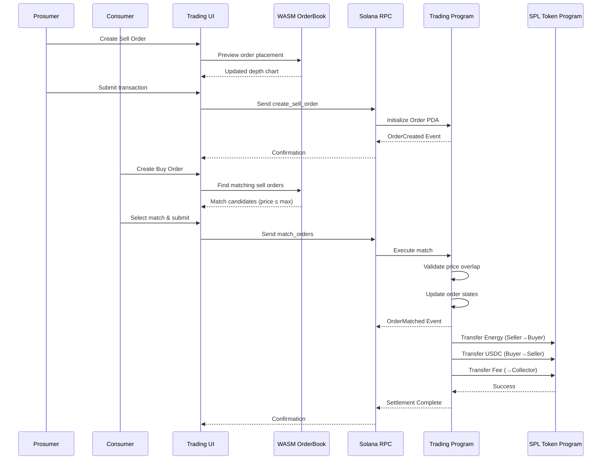
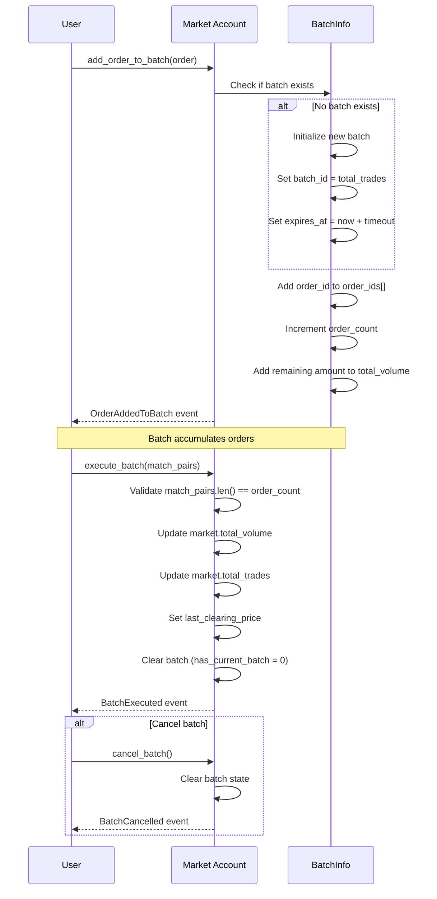
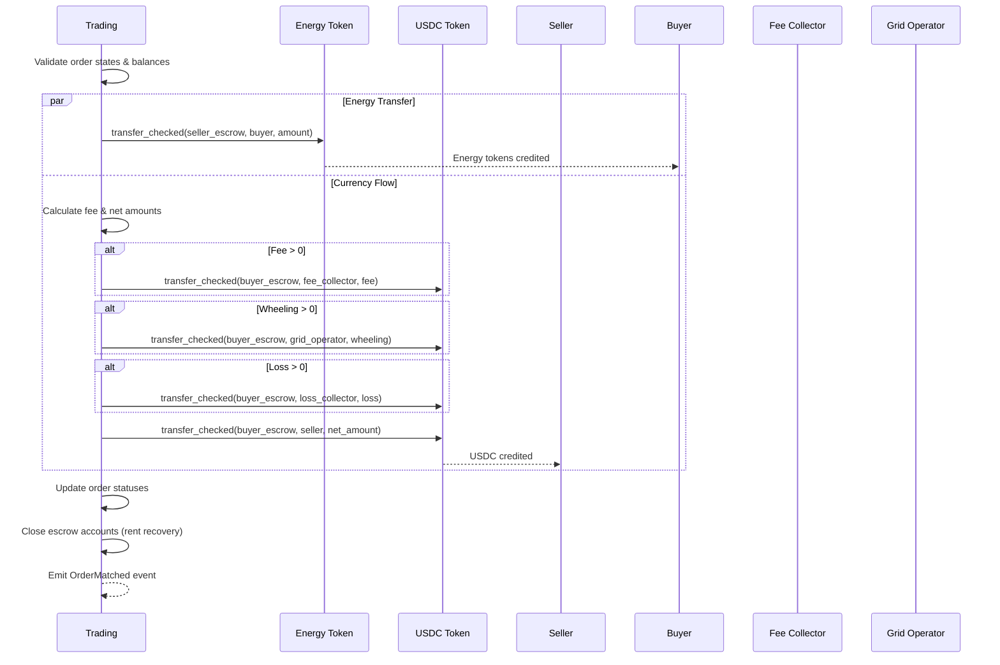

# P2P Matching Order Plan

## GridTokenX Energy Trading Platform

---

## 1. Executive Summary

This document outlines the architecture and implementation plan for peer-to-peer (P2P) energy order matching in the GridTokenX platform. The system enables direct energy trading between prosumers (sellers) and consumers (buyers) with deterministic matching algorithms, atomic settlement, and trustless execution via Solana smart contracts.

---

## 2. System Architecture

### 2.1 Component Overview

```
┌─────────────────────────────────────────────────────────────────────────┐
│                         P2P MATCHING SYSTEM                             │
├─────────────────────────────────────────────────────────────────────────┤
│  Frontend Layer          │  WASM Engine          │  Blockchain Layer    │
│  (Next.js/React)         │  (Rust/WASM)          │  (Solana/Anchor)     │
├──────────────────────────┼───────────────────────┼──────────────────────┤
│  • Order Creation UI     │  • OrderBook          │  • Trading Program   │
│  • Depth Chart Viz       │  • Price-Time Match   │  • Match Instruction │
│  • Match Preview         │  • Depth Aggregation  │  • Atomic Settlement │
│  • Wallet Integration    │  • Slippage Calc      │  • Token Transfers   │
└──────────────────────────┴───────────────────────┴──────────────────────┘
```

### 2.2 Data Flow



---

## 3. Order Matching Algorithm

### 3.1 Price-Time Priority Matching

The matching engine follows **price-time priority** (Pro-Rata variant):

1. **Price Priority**: Higher bids take precedence over lower bids; lower asks take precedence over higher asks
2. **Time Priority**: At the same price level, earlier orders are filled first
3. **Pro-Rata**: Large orders may match against multiple counterparties

### 3.2 Matching Rules

```rust
// Core matching condition
MATCH_CONDITION: bid.price >= ask.price

// Execution price determination (price improvement)
EXECUTION_PRICE: sell_order.price_per_kwh  // Seller's price (better for buyer)

// Match quantity determination
MATCH_AMOUNT: min(buyer_remaining, seller_remaining, requested_amount)
where:
  buyer_remaining = buy_order.amount - buy_order.filled_amount
  seller_remaining = sell_order.amount - sell_order.filled_amount
```

### 3.3 Matching Pseudocode

```rust
fn match_orders(buy_order: Order, sell_order: Order, match_amount: u64) -> Result<Match> {
    // Preconditions
    require!(buy_order.status == Active || PartiallyFilled);
    require!(sell_order.status == Active || PartiallyFilled);
    require!(buy_order.price_per_kwh >= sell_order.price_per_kwh);
    
    // Calculate actual match amount
    let buy_remaining = buy_order.amount - buy_order.filled_amount;
    let sell_remaining = sell_order.amount - sell_order.filled_amount;
    let actual_match = min(match_amount, buy_remaining, sell_remaining);
    
    // Price determination (clearing at seller's price)
    let clearing_price = sell_order.price_per_kwh;
    
    // Fee calculation (25 bps default)
    let total_value = actual_match * clearing_price;
    let fee = total_value * market_fee_bps / 10000;
    
    // Update order states
    buy_order.filled_amount += actual_match;
    sell_order.filled_amount += actual_match;
    
    // Status transitions
    if buy_order.filled_amount >= buy_order.amount {
        buy_order.status = Completed;
    } else {
        buy_order.status = PartiallyFilled;
    }
    
    if sell_order.filled_amount >= sell_order.amount {
        sell_order.status = Completed;
    } else {
        sell_order.status = PartiallyFilled;
    }
    
    // Create trade record
    TradeRecord {
        buy_order: buy_key,
        sell_order: sell_key,
        amount: actual_match,
        price_per_kwh: clearing_price,
        total_value,
        fee_amount: fee,
        executed_at: now(),
    }
}
```

---

## 4. Data Structures

### 4.1 Order Structure (On-Chain)

```rust
#[account(zero_copy)]
#[repr(C)]
pub struct Order {
    pub seller: Pubkey,         // 32 bytes - Seller wallet
    pub buyer: Pubkey,          // 32 bytes - Buyer wallet
    pub order_id: u64,          // 8 bytes  - Unique order ID
    pub amount: u64,            // 8 bytes  - Total energy amount (kWh * 10^6)
    pub filled_amount: u64,     // 8 bytes  - Already filled amount
    pub price_per_kwh: u64,     // 8 bytes  - Price in USDC per kWh
    pub order_type: u8,         // 1 byte   - Sell=0, Buy=1
    pub status: u8,             // 1 byte   - Active/Partial/Completed/Cancelled
    pub _padding: [u8; 6],      // 6 bytes  - Alignment
    pub created_at: i64,        // 8 bytes  - Unix timestamp
    pub expires_at: i64,        // 8 bytes  - Order expiry
}
// Total: 120 bytes + 8 discriminator = 128 bytes
```

### 4.2 Order Status Lifecycle

```
┌─────────┐    create     ┌─────────┐
│  Init   │ ────────────> │ Active  │
└─────────┘               └────┬────┘
                               │
              ┌────────────────┼────────────────┐
              │                │                │
              ▼                ▼                ▼
        ┌──────────┐     ┌──────────┐     ┌──────────┐
        │ Cancelled│     │Partially │     │Completed │
        │(manual)  │     │  Filled  │     │(fully   │
        └──────────┘     └────┬─────┘     │  filled) │
                              │           └──────────┘
                              │ match more
                              ▼
                         ┌──────────┐
                         │Completed │
                         └──────────┘
```

### 4.3 Trade Record

```rust
#[account]
#[derive(InitSpace)]
pub struct TradeRecord {
    pub sell_order: Pubkey,     // Reference to sell order
    pub buy_order: Pubkey,      // Reference to buy order
    pub seller: Pubkey,         // Seller wallet
    pub buyer: Pubkey,          // Buyer wallet
    pub amount: u64,            // Matched amount
    pub price_per_kwh: u64,     // Execution price
    pub total_value: u64,       // Total USDC value
    pub fee_amount: u64,        // Platform fee
    pub executed_at: i64,       // Timestamp
}
// PDA Seed: [b"trade", buy_order.key(), sell_order.key()]
```

---

## 5. Program Instructions

### 5.1 Instruction Reference

| Instruction | Discriminator | Parameters | Accounts Required |
|-------------|---------------|------------|-------------------|
| `initialize_market` | `[35, 35, 189, 193, 155, 48, 170, 203]` | - | authority, market, system_program |
| `create_sell_order` | `[53, 52, 255, 44, 191, 74, 171, 225]` | `order_id: u64`, `amount: u64`, `price: u64` | authority, market, order, governance_config |
| `create_buy_order` | Derived | `order_id: u64`, `amount: u64`, `max_price: u64` | authority, market, order, governance_config |
| `match_orders` | `[17, 1, 201, 93, 7, 51, 251, 134]` | `match_amount: u64` | authority, market, buy_order, sell_order, trade_record, governance_config |
| `add_order_to_batch` | Derived | - | authority, market, order, governance_config |
| `execute_batch` | Derived | `match_pairs: Vec<MatchPair>` | authority, market, governance_config |
| `cancel_batch` | Derived | - | authority, market, governance_config |
| `execute_atomic_settlement` | Derived | `amount: u64`, `price: u64`, `wheeling: u64`, `loss: u64` | + escrow accounts, token_programs |
| `cancel_order` | Derived | - | authority, market, order, governance_config |

### 5.2 Batch Matching Instructions

Batch matching allows multiple orders to be grouped and executed in a single transaction, reducing compute costs and improving throughput.

#### 5.2.1 Batch Configuration

```rust
pub struct BatchConfig {
    pub enabled: u8,                    // 0 = disabled, 1 = enabled
    pub max_batch_size: u32,          // Max orders per batch (default: 100)
    pub batch_timeout_seconds: u32,   // Batch expiration time (default: 300)
    pub min_batch_size: u32,          // Minimum orders before execution (default: 5)
    pub price_improvement_threshold: u16, // Price improvement for batch matching
}
```

#### 5.2.2 Batch Processing Flow



#### 5.2.3 MatchPair Structure

```rust
pub struct MatchPair {
    pub buy_order: Pubkey,   // Buy order account
    pub sell_order: Pubkey,  // Sell order account
    pub amount: u64,         // Match amount
    pub price: u64,          // Execution price
}
```

#### 5.2.4 Error Codes

| Code | Error | Trigger |
|------|-------|---------|
| `6010` | `BatchProcessingDisabled` | Batch not enabled in config |
| `6011` | `BatchSizeExceeded` | Order count > max_batch_size |
| `6012` | `ReentrancyLock` | Batch in execution |
| `6013` | `EmptyBatch` | No orders in batch |
| `6014` | `BatchTooLarge` | Order count > 32 or batch expired |

---

## 6. Settlement Flow

### 6.1 Atomic Settlement Sequence



### 6.2 Fee Structure

| Component | Calculation | Destination |
|-----------|-------------|-------------|
| Market Fee | `total_value * 25 / 10000` (25 bps) | Platform treasury |
| Wheeling Charge | Variable based on distance | Grid operator |
| Loss Cost | Variable based on network loss | Grid operator |
| **Net to Seller** | `total_value - fee - wheeling - loss` | Seller wallet |

---

## 7. Client-Side Components

### 7.1 WASM OrderBook Engine

```rust
#[wasm_bindgen]
pub struct OrderBook {
    bids: Vec<Order>,  // Sorted: price DESC, time ASC
    asks: Vec<Order>,  // Sorted: price ASC, time ASC
}

impl OrderBook {
    /// Add order with automatic sorting
    pub fn add_order(&mut self, id, side, price, quantity, timestamp);
    
    /// Execute matching algorithm
    pub fn match_orders(&mut self) -> Vec<Match>;
    
    /// Get depth data for visualization
    pub fn get_depth(&self, levels: usize) -> DepthData;
    
    /// Cancel order by ID
    pub fn cancel_order(&mut self, order_id: u32) -> bool;
}
```

### 7.2 Matching Preview (Client-Side)

Before on-chain submission, the frontend uses WASM to:

1. **Simulate match**: Preview expected execution price and amount
2. **Calculate slippage**: Warn if price moved > 5% from quote
3. **Aggregate depth**: Show cumulative order book depth
4. **Estimate fees**: Display total cost including platform fees

---

## 8. Implementation Phases

### Phase 1: Core Matching (Completed ✓)
- [x] Order creation (sell/buy)
- [x] Basic match_orders instruction
- [x] Order status management
- [x] Trade record creation

### Phase 2: Settlement (Completed ✓)
- [x] Atomic settlement with token transfers
- [x] Fee calculation and distribution
- [x] Escrow account management
- [x] Event emission

### Phase 3: Advanced Features (Partially Complete)
- [x] Batch matching (multiple orders per tx) - **IMPLEMENTED**
  - `add_order_to_batch` - Add orders to batch
  - `execute_batch` - Execute batch with match pairs
  - `cancel_batch` - Cancel pending batch
  - Max 32 orders per batch
- [ ] Market depth tracking in real-time
- [ ] Price history aggregation
- [ ] Slippage protection (on-chain)

### Phase 4: Optimization (Planned)
- [ ] Order book sharding for parallelism
- [ ] Zero-knowledge confidential trading
- [ ] Off-chain order relay with on-chain settlement
- [ ] Automated market maker (AMM) fallback

---

## 9. Security Considerations

### 9.1 Re-entrancy Protection
```rust
pub struct Market {
    pub locked: u8,  // Re-entrancy guard
    // ...
}

// In settlement:
require!(market.locked == 0, TradingError::Reentrancy);
market.locked = 1;
// ... transfers ...
market.locked = 0;
```

### 9.2 Price Oracle Validation
- Meter readings must be < 1 hour old
- Oracle-signed attestations required for settlement

### 9.3 Access Control
- Only order owner can cancel
- Only market authority can update params
- Governance config enforces maintenance mode

---

## 10. Performance Characteristics

| Instruction | Compute Units | % of 200k Limit | Optimization |
|-------------|---------------|-----------------|--------------|
| `register_user` | 5,200 | 2.6% | - |
| `create_order` | 18,000 | 9.0% | Zero-Copy PDAs |
| `match_orders` | 35,200 | 17.6% | AccountLoader |
| `settle_batch` | 140,000 | 70.0% | CPI batching |

### 10.1 Scalability Limits
- Max orders per market: Unlimited (separate PDAs)
- Max batch size: 32 orders (BatchInfo constraint)
- Price levels tracked: 20 per side
- Price history: 24 hourly points

---

## 11. Integration Points

### 11.1 Frontend → Smart Contract
```typescript
// Example: Create and match orders
const createSellTx = await program.methods
  .createSellOrder(orderId, energyAmount, pricePerKwh)
  .accounts({
    market: marketPda,
    order: orderPda,
    authority: wallet.publicKey,
    governanceConfig: governancePda,
  })
  .rpc();

const matchTx = await program.methods
  .matchOrders(matchAmount)
  .accounts({
    market: marketPda,
    buyOrder: buyOrderPda,
    sellOrder: sellOrderPda,
    tradeRecord: tradePda,
    authority: wallet.publicKey,
  })
  .rpc();
```

### 11.2 Event Listening
```typescript
// Subscribe to OrderMatched events
program.addEventListener('OrderMatched', (event) => {
  console.log('Trade executed:', {
    buyer: event.buyer.toBase58(),
    seller: event.seller.toBase58(),
    amount: event.amount.toNumber(),
    price: event.price.toNumber(),
  });
});
```

## 12. Batch Matching Integration

### 12.1 TypeScript Example

```typescript
// Add orders to batch
const addOrderTx = await program.methods
  .addOrderToBatch()
  .accounts({
    market: marketPda,
    order: orderPda,
    authority: wallet.publicKey,
    governanceConfig: governancePda,
  })
  .rpc();

// Execute batch with match pairs
const matchPairs = [
  {
    buyOrder: buyOrder1,
    sellOrder: sellOrder1,
    amount: new BN(1000000),
    price: new BN(150000),
  },
  {
    buyOrder: buyOrder2,
    sellOrder: sellOrder2,
    amount: new BN(2000000),
    price: new BN(155000),
  },
];

const executeBatchTx = await program.methods
  .executeBatch(matchPairs)
  .accounts({
    market: marketPda,
    authority: wallet.publicKey,
    governanceConfig: governancePda,
  })
  .rpc();

// Listen for batch events
program.addEventListener('BatchExecuted', (event) => {
  console.log('Batch executed:', {
    batchId: event.batchId.toString(),
    orderCount: event.orderCount,
    totalVolume: event.totalVolume.toString(),
  });
});
```

### 12.2 Gas Efficiency

| Execution Mode | Compute Units | Orders/TX | CU/Order |
|----------------|---------------|-----------|----------|
| Single Match | 35,200 | 1 | 35,200 |
| Batch (5) | ~50,000 | 5 | ~10,000 |
| Batch (10) | ~70,000 | 10 | ~7,000 |
| Batch (32) | ~150,000 | 32 | ~4,688 |

Batch matching provides **~7.5x gas efficiency** for 32 orders compared to single matches.

---

## 13. Conclusion

The GridTokenX P2P matching system provides:

1. **Deterministic matching** via price-time priority
2. **Trustless settlement** via Solana atomic transactions
3. **Real-time preview** via WASM client-side engine
4. **Transparent fees** with 25 bps platform fee
5. **Batch execution** for ~7.5x gas efficiency
6. **Extensible architecture** supporting ZK upgrades

Next steps:
- Deploy confidential trading with ZK proofs
- Integrate automated market maker for liquidity
- Implement off-chain order relay with on-chain settlement

---

*Document Version: 1.0*
*Last Updated: 2026-02-21*
*GridTokenX Platform*
