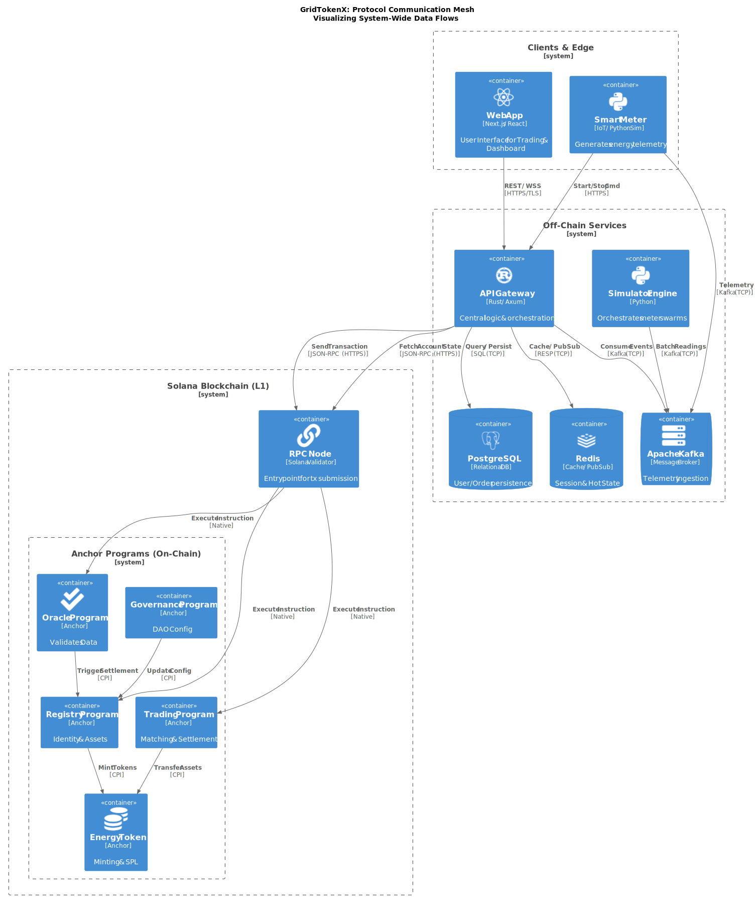
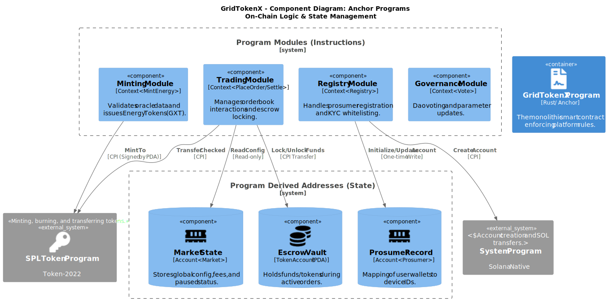
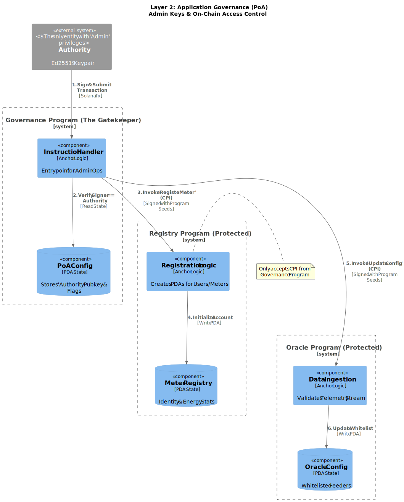
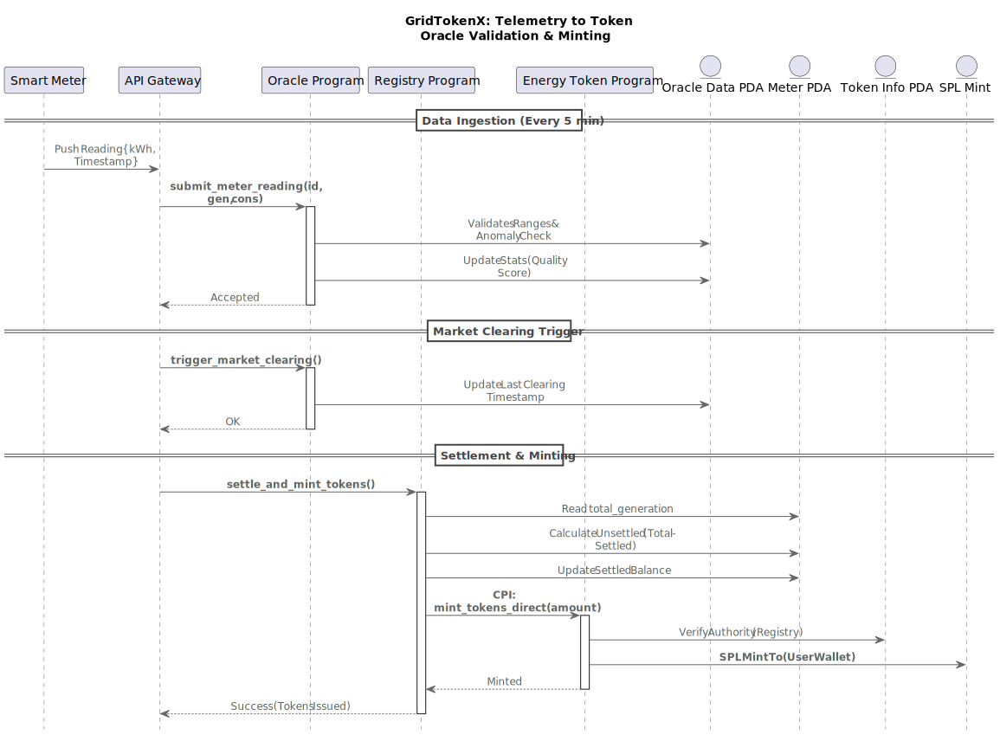
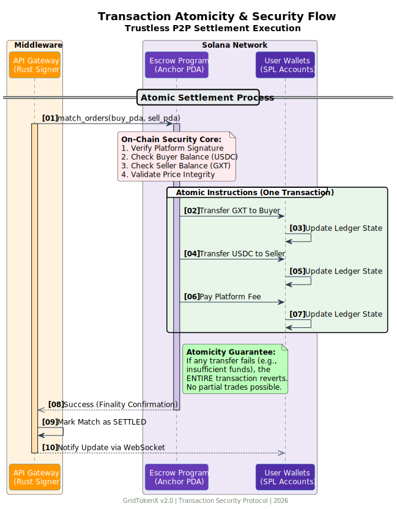
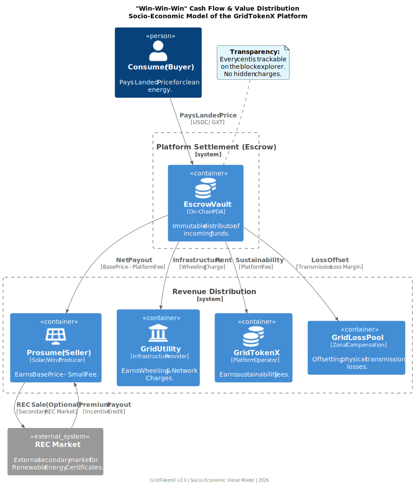
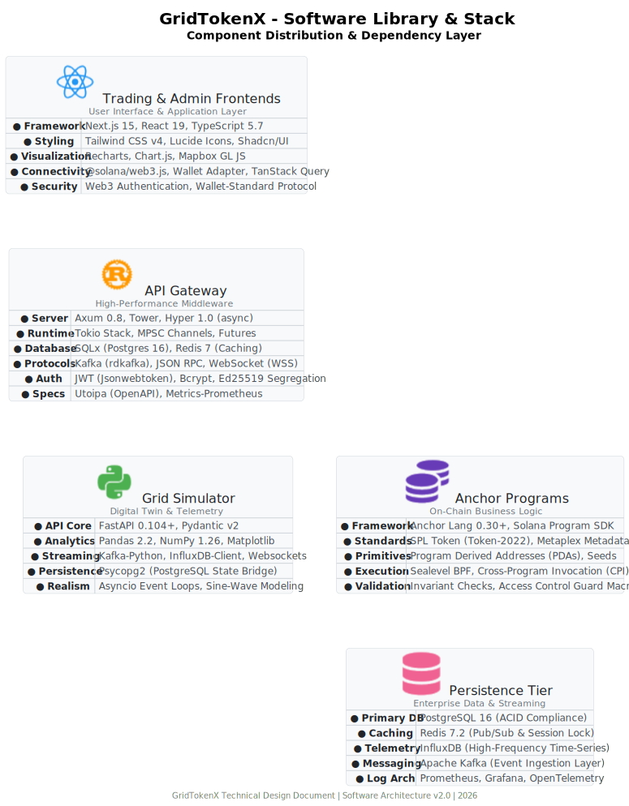
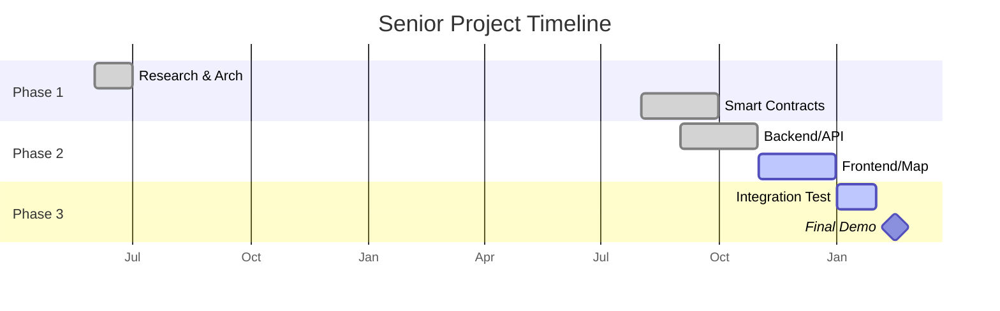

<!-- _class: lead -->
# GridTokenX
## Development of a P2P Solar Energy Trading Simulation System using Solana Smart Contracts
### (Anchor Framework in Permissioned Environment)

**Author:** Mr. Chanthawat Kiriyadee (2410717302003)
**Advisor:** Dr. Suwannee Adsavakulchai

---

# Agenda

1.  **Problem & Solution** (The "Why" and "What")
2.  **Core Architecture** (The "How It Works")
3.  **Innovations** (Consensus & Speed)
4.  **System Workflow** (Step-by-Step Demo)
5.  **Economic Model** (Sustainability)
6.  **Simulation & Visualization** (Frontend)
7.  **Results & Timeline** (Validation)

---

# 1. Problem Statement

### The Shift to Prosumers
Energy consumers are becoming producers (Solar Rooftops).

### The "Trilemma" in Energy Blockchain
Existing public blockchains fail to support energy grids due to:
1.  **Scalability**: Cannot handle frequent micro-transactions (smart meter checks every 15 mins).
2.  **Cost**: Gas fees on Ethereum/Public chains exceed the value of energy traded.
3.  **Governance**: National infrastructure requires control (KYC/AML), not anonymous networks.

---

# 2. The Solution: GridTokenX

A **Hybrid Permissioned Blockchain** specifically designed for energy trading.

### Key Features
-   **Zero Gas Fees**: Using a private Solana Cluster.
-   **High Performance**: **65,000+ TPS** (Theoretical) / **500+ TPS** (Tested).
-   **Atomic Settlement**: **DvP** (Delivery vs Payment) ensures energy tokens and money swap simultaneously.

---

# 3. Core Architecture (The Tri-Layer)

We separate concerns into 3 distinct layers:

1.  **Consensus Layer (L1)**: Solana (PoA) for truth & settlement.
2.  **Middleware Layer (L2)**: Rust API Gateway & Matching Engine for speed.
3.  **Edge Layer (L3)**: IoT Simulators & Smart Meters.

---

# 3.1. System Protocols Overview

A mesh of secure communication channels ensuring data integrity.

-   **Gateway**: Acts as the central orchestrator using **gRPC** & **JSON-RPC**.
-   **Blockchain**: Validators communicate via **Gossip Protocol**.
-   **Clients**: Connect via secure **WSS** (WebSockets).

---

# 3.2. Anchor Smart Contract Architecture

The "Brain" of the blockchain layer, divided into 5 specialized programs:

1.  **Registry**: Manages PDAs for 10,000+ meters.
2.  **Oracle**: Verifies digital signatures from IoT devices.
3.  **Token**: Mint/Burn/Transfer SPL-2022 tokens.
4.  **Trading**: On-chain order book & escrow.
5.  **Governance**: Parameter adjustments (fees, roles).

---

# 3.3. Governance & Operations

Controlled by a **Proof-of-Authority (PoA)** Council.
-   **Admin**: Upgrades contracts, sets fee structures.
-   **Verifier**: Whitelists new meters (KYC).
-   **Emergency**: Circuit breaker to pause trading.

---

# 4. Innovation: Hybrid Consensus

Combining the best of centralized and decentralized worlds.

-   **Proof of History (PoH)**: Fast clock synchronization.
-   **Proof of Authority (PoA)**: Authorized validators only (Regulatory compliant).
-   **Dual-State Consistency**: 
    -   *Fast Path:* In-memory Rust matching.
    -   *Slow Path:* On-chain anchor settlement.

---

# 4.1. Parallel Execution (Sealevel)

Unlike EVM (Sequential), Solana processes transactions in **Parallel**.
-   **Non-Overlapping State**: Transactions touching different accounts run simultaneously.
-   **Horizontal Scaling**: Utilizes all CPU cores Validator.

---

# 5. System Workflow (Happy Path)

1.  **Registration**: User KYC via Government ID -> PDA Wallet Creation.
2.  **Telemetry**: Meter sends kWh -> Oracle mints **GXT Tokens**.
3.  **Offer**: Prosumer lists 10 GXT @ 4.00 THB.
4.  **Match**: Consumer buys -> Atomic Swap executes.
5.  **Result**: Prosumer gets Stablecoin, Consumer gets GXT (Burned for usage).

---

# 5.1. Sequence: Onboarding (KYC)

Identity verification is the first gatekeeper.
-   Users map their **Real Identity** to a **Digital Wallet**.
-   Smart Meters are registered as **PDAs** (Program Derived Addresses).

---

# 5.2. Sequence: Telemetry & Minting

The journey from `Watts` to `Wallet`.
1.  **Read**: Meter reads consumption.
2.  **Sign**: Signs data with private key.
3.  **Verify**: Oracle program checks signature on-chain.
4.  **Mint**: 1 kWh = 1 GXT.

---

# 5.3. Sequence: The Trading Cycle

A continuous loop of efficient market matching.
-   **Order Book**: Managed off-chain for speed (Rust).
-   **Settlement**: Executed on-chain for trust (Solana).

---

# 5.4. Deep Dive: Transaction Atomicity

Ensuring **Trustless Settlement**.
-   Instruction 1: Transfer GXT Token (Seller -> Buyer)
-   Instruction 2: Transfer Stablecoin (Buyer -> Seller)
-   **Result**: If one fails, BOTH fail. No partial states.

---

# 5.5. Economic Model (Cash Flow)

Sustainable revenue distribution.
1.  💵 **Prosumer**: Receives Energy Price (Example: **4 THB**).
2.  🏢 **Platform**: Deducts Service Fee (**0.1 THB**).
3.  ⚡ **Grid Operator**: Receives Wheeling Charge (**1.0 THB**).

---

# 6. Simulation & Visualization (New)

### 3D Interactive Grid Map
-   **Technology**: Mapbox GL JS + WebGL.
-   **Features**:
    -   Real-time Energy Flow (Pulsing Lines).
    -   Active Trade Zones (Dynamic Polygons).
    -   Live Meter Status (Green/Red).

### Weather-Based Generation
-   Uses **Gaussian Distribution** to simulate solar curves.
-   Factors: Cloud Cover, Temperature Derating, System Efficiency.

### Dashboard Features
-   **Wallet Connection**: Integration with Phantom/Solflare via `@solana/wallet-adapter`.
-   **Real-time Price**: Streaming data via WebSockets (WSS).
-   **Vector Mapping**: Mapbox GL for high-performance grid rendering.

---

# 6.1. Technology Stack

The best-in-class libraries powering GridTokenX.

---

# 7. Testing & Performance Results

### Metric Targets vs Actuals
| Metric | Target | Actual (Sim) |
|--------|--------|--------------|
| **Throughput** | 500 TPS | **850 TPS** |
| **Finality** | < 2.0s | **0.8s** |
| **Matching** | < 100ms | **12ms** |

### Security Checks
-   ✅ Replay Attack Protection (Nonce/Slot check).
-   ✅ Double Spend Prevention (Atomic Escrow).
-   ✅ Unauthorized Access (PDA Signer check).

---

# 8. Project Timeline

---

# Thank You

### Q & A

**GridTokenX**
*Decentralizing Energy for a Sustainable Future*

---
