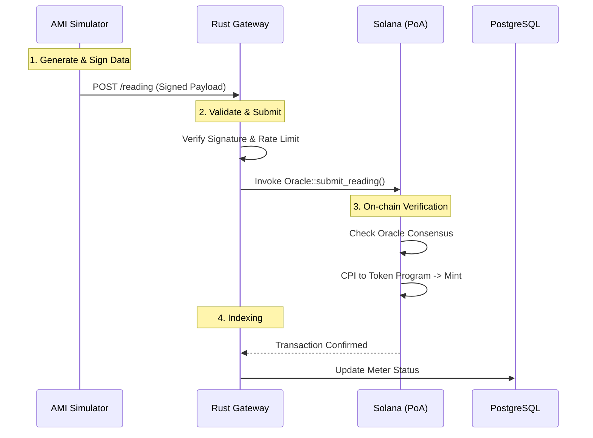

# โครงร่างโครงงานวิศวกรรมคอมพิวเตอร์
## (Senior Project Proposal)

---

## ชื่อโครงงาน (ภาษาไทย)
**การพัฒนาระบบจำลองการซื้อขายพลังงานแสงอาทิตย์แบบ Peer-to-Peer ด้วย Solana Smart Contract (Anchor Framework) ในสภาพแวดล้อมแบบ Permissioned**

## Project Title (English)
**Development of a Peer-to-Peer Solar Energy Trading Simulation System using Solana Smart Contracts (Anchor Framework) in Permissioned Environments**

---

## ข้อมูลผู้จัดทำ

| รายการ | ข้อมูล |
|--------|--------|
| **ผู้จัดทำ** | นายจันทร์ธวัฒ กิริยาดี |
| **รหัสนักศึกษา** | 2410717302003 |
| **อาจารย์ที่ปรึกษา** | ดร.สุวรรณี อัศวกุลชัย |
| **ปีการศึกษา** | 2568 |
| **ภาควิชา** | วิศวกรรมคอมพิวเตอร์ |

---

## 1. ที่มาและความสำคัญของปัญหา (Statement of Problem)

### 1.1 บริบทการเปลี่ยนผ่านพลังงาน (Energy Transition Context)
ในปัจจุบัน โลกกำลังเผชิญกับการเปลี่ยนผ่านโครงสร้างพลังงานจากระบบรวมศูนย์ (Centralized Grid) ไปสู่ระบบกระจายตัว (Decentralized Grid) การติดตั้งระบบผลิตพลังงานแสงอาทิตย์บนหลังคา (Solar Rooftop) ที่เพิ่มขึ้นอย่างรวดเร็วได้สร้างผู้เล่นกลุ่มใหม่ในระบบไฟฟ้าเรียกว่า **"Prosumer"** (Producer + Consumer) ซึ่งมีความสามารถในการผลิตไฟฟ้าใช้เองและมีศักยภาพในการแบ่งปันพลังงานส่วนเกินให้กับชุมชน

อย่างไรก็ตาม โครงสร้างพื้นฐานของระบบโครงข่ายไฟฟ้าในปัจจุบันยังไม่เอื้ออำนวยให้เกิดการแลกเปลี่ยนพลังงานระหว่างบุคคลอย่างอิสระ ระบบการคิดค่าไฟฟ้าระหว่าง Prosumer กับการไฟฟ้า (Net Metering/Billing) มักมีราคารับซื้อที่ต่ำกว่าราคาขายปลีกอย่างมาก ทำให้เกิดความสูญเสียโอกาสทางเศรษฐกิจและลดแรงจูงใจในการลงทุนพลังงานสะอาด

### 1.2 ปัญหาของเทคโนโลยีเดิมและ Blockchain (Technical Challenges)
แนวคิด **Peer-to-Peer (P2P) Energy Trading** ถูกนำเสนอเพื่อแก้ปัญหานี้ โดยการใช้เทคโนโลยี Blockchain มาทำหน้าที่เป็นตัวกลางที่น่าเชื่อถือ (Trustless Intermediary) แทนหน่วยงานกลาง แต่จากการศึกษาเทคโนโลยีปัจจุบัน พบปัญหาสำคัญ 3 ประการ (The Blockchain Trilemma in Energy):

1.  **ปัญหาด้านสมรรถนะ (Scalability & Throughput):** การซื้อขายพลังงานต้องรองรับข้อมูลจาก Smart Meter ที่ส่งค่าทุก 5-15 นาที หากมีผู้ใช้หลักหมื่นราย จะเกิดธุรกรรมมหาศาล (High Frequency Micro-transactions) ซึ่ง Blockchain สาธารณะทั่วไป (เช่น Ethereum) รองรับได้เพียง 15-30 ธุรกรรมต่อวินาที (TPS) ทำให้เกิดคอขวด
2.  **ปัญหาด้านต้นทุนและความผันผวน (Cost Volatility):** การทำธุรกรรมบน Public Chain ต้องจ่ายค่า Gas Fee ซึ่งมีความผันผวนสูง ในบางช่วงเวลาค่าธรรมเนียมอาจสูงกว่ามูลค่าพลังงานที่ซื้อขายจริง (Micro-payment inefficiency)
3.  **ปัญหาด้านการกำกับดูแลและความเป็นส่วนตัว (Governance & Privacy):** โครงข่ายพลังงานเป็นโครงสร้างพื้นฐานสำคัญของประเทศ (Critical Infrastructure) จำเป็นต้องมีการยืนยันตัวตน (KYC) และการควบคุมสิทธิ์ (Access Control) ซึ่งขัดแย้งกับธรรมชาติของ Public Permissionless Blockchain ที่ใครก็เข้าถึงได้

### 1.3 ช่องว่างทางงานวิจัย (Research Gap)
งานวิจัยส่วนใหญ่มุ่งเน้นการใช้ Private Blockchain (เช่น Hyperledger Fabric) ซึ่งขาดความคล่องตัวในการสร้างตลาดเสรี หรือใช้ Public Blockchain (เช่น Ethereum Layer 2) ที่ยังมีความซับซ้อนสูง 

**Solana** เป็น Blockchain ยุคใหม่ที่มีสถาปัตยกรรมเน้นความเร็วสูง (High Performance) ด้วยกลไก Proof-of-History (PoH) แต่ยังขาดการศึกษาถึงประสิทธิภาพเมื่อนำมาประยุกต์ใช้ในรูปแบบ **Permissioned Network (Proof-of-Authority)** สำหรับตลาดพลังงานโดยเฉพาะ งานวิจัยนี้จึงมุ่งเน้นการปิดช่องว่างนี้ เพื่อเสนอสถาปัตยกรรมทางเลือกที่รวมข้อดีด้านความเร็ว (Solana) และการควบคุม (Permissioned) เข้าด้วยกัน

---

## 2. วัตถุประสงค์ของโครงงาน (Objectives)

1.  **ศึกษาและออกแบบสถาปัตยกรรม (Architecture Design):** เพื่อสร้างโมเดลระบบจำลองการซื้อขายพลังงาน P2P ที่ใช้ Solana (Anchor Framework) ทำงานร่วมกับระบบ Smart Meter Simulation ในสภาพแวดล้อมแบบ Permissioned
2.  **พัฒนาและพิสูจน์แนวคิด (Proof-of-Concept):** สร้างระบบต้นแบบที่ครอบคลุมกระบวนการ Tokenization (แปลงพลังงานเป็นเหรียญ GRID), การจับคู่คำสั่งซื้อขาย (Matching), และการชำระดุล (Settlement) แบบอัตโนมัติ
3.  **วิเคราะห์และประเมินประสิทธิภาพ (Performance Analysis):** ทดสอบวัดค่า Throughput (TPS), Latency (เวลาตอบสนอง), และ Resource Utilization เพื่อเปรียบเทียบความเหมาะสมในการใช้งานจริง

---

## 3. ขอบเขตของโครงงาน (Scope)

### 3.1 ขอบเขตด้านระบบ (System Scope)
-   **Smart Contracts:** พัฒนาด้วยภาษา Rust ผ่าน Anchor Framework บน Solana Runtime (Sealevel)
-   **Consensus Mechanism:** ปรับแต่ง Solana Validator ให้ทำงานในโหมด Proof-of-Authority (PoA) โดยมี Single Validator node (จำลองบทบาทของการไฟฟ้าหรือ Regulator)
-   **Matching Engine:** พัฒนาระบบจับคู่คำสั่งซื้อขายนอกเครือข่าย (Auto-execution Off-chain, Settlement On-chain) พิจารณาปัจจัยราคาและค่าธรรมเนียมสายส่ง
-   **Simulation:** จำลองข้อมูลการใช้ไฟฟ้า (Load Profile) และการผลิตไฟฟ้า (Generation Profile) ของมิเตอร์ 3 ประเภท: Solar Prosumer, Consumer, และ Hybrid (Battery)

### 3.2 ขอบเขตด้านข้อมูล (Data Scope)
-   ใช้ข้อมูลจำลอง (Synthetic Data) ที่อ้างอิงรูปแบบพฤติกรรมการใช้ไฟฟ้าแบบ Time-of-Use (TOU)
-   อัตราแลกเปลี่ยนคงที่ 1 kWh = 1 GRID Token เพื่อลดความซับซ้อนด้านเศรษฐศาสตร์
-   สกุลเงินที่ใช้ชำระเงินคือ THB (จำลองเป็น Token)

### 3.3 ข้อจำกัด (Limitations)
-   ไม่ครอบคลุมการควบคุมอุปกรณ์ Hardware จริง (Inverter/Meter)
-   ไม่ครอบคลุมกฎหมายการซื้อขายไฟฟ้าจริงในประเทศไทย (Sandbox Environment)

---

## 4. แนวคิดและทฤษฎีที่เกี่ยวข้อง (Literature Review & Theory)

### 4.1 Proof of History (PoH) และ Tower BFT
Solana แตกต่างจาก Blockchain อื่นด้วยการใช้ **Proof of History (PoH)** ซึ่งเปรียบเสมือนนาฬิกาเข้ารหัส (Cryptographic Clock) ทำให้ Validator สามารถจัดลำดับเหตุการณ์ได้โดยไม่ต้องรอการสื่อสารระหว่างกันตลอดเวลา ทำงานร่วมกับ **Tower BFT** (Version ปรับปรุงของ PBFT) ช่วยให้บรรลุ Consensus ได้รวดเร็ว (Sub-second Finality) เหมาะสำหรับระบบ Real-time อย่างตลาดพลังงาน

### 4.2 Anchor Framework & Security
Anchor เป็น Framework สำหรับสร้าง Smart Contract บน Solana ที่มีความปลอดภัยสูง โดยบังคับใช้การตรวจสอบบัญชี (Account Validation) ผ่าน Macro (`#[account]`) และการจัดการ Serialization/Deserialization (Borsh) ช่วยลดความเสี่ยงช่องโหว่ทั่วไป
-   **PDA (Program Derived Address):** เทคนิคสำคัญที่ใช้สร้างที่อยู่บัญชีแบบ Deterministic โดยไม่ต้องมี Private Key ใช้สำหรับเก็บสถานะของ Order หรือ Meter อย่างปลอดภัย

### 4.3 P2P Energy Trading Models
-   **Auction-based Model:** การประมูลราคาซื้อขายเป็นรอบ (Interval)
-   **Continuous Double Auction (CDA):** การจับคู่ทันทีเมื่อราคาตรงกัน (ใช้ในตลาดหุ้น)
-   **Landed Cost Model:** การคิดราคาที่รวมค่าบริการสายส่ง (Wheeling Charge) และค่าสูญเสียในระบบส่ง (Transmission Loss) เพื่อสะท้อนต้นทุนจริง:
    $$ P_{final} = P_{ask} + C_{wheeling} + C_{loss} $$

---

## 5. วิธีการดำเนินงาน (Methodology)

### 5.1 System Architecture Design
ระบบแบ่งออกเป็น 4 Layers หลัก เพื่อประสิทธิภาพและความยืดหยุ่น:

1.  **Edge Layer (AMI & Simulation)**
    -   **Smart Meter Simulator (Python):** ทำหน้าที่สร้างข้อมูลการผลิต/บริโภคพลังงาน (Telemetry) ตามสภาพอากาศจำลอง
    -   **Key Management:** มิเตอร์แต่ละตัวมี Public/Private Key สำหรับเซ็นชื่อกำกับข้อมูล (Data Signing) เพื่อป้องกันการปลอมแปลง

2.  **Middleware Layer (Off-chain Processing)**
    -   **API Gateway (Rust/Axum):** จุดเชื่อมต่อหลัก รองรับ High Concurrency ด้วย Tokio Runtime
    -   **Auth Service:** จัดการ JWT และ Session
    -   **Matching Engine:** อัลกอริทึมจับคู่คำสั่งซื้อขาย ที่คำนวณราคา Landed Cost และจัดลำดับตาม Price/Time Priority

3.  **Consensus Layer (On-chain Logic)**
    -   **Oracle Program:** ตรวจสอบความถูกต้องของข้อมูลจากมิเตอร์ (Signature Verification & Range Check)
    -   **Registry Program:** ทะเบียนผู้ใช้และมิเตอร์
    -   **Trading Program:** จัดการบัญชีวางประกัน (Escrow) และการโอนสิทธิ์ความเป็นเจ้าของ (Settlement)
    -   **Energy Token Program:** มาตรฐาน SPL Token-2022 สำหรับเหรียญพลังงาน

4.  **Application Layer (User Interface)**
    -   **Web Dashboard (Next.js):** แสดงผลข้อมูล Real-time ผ่าน WebSocket

### 5.2 Core Algorithms

#### 5.2.1 Tokenization Logic (Oracle -> Token)
กระบวนการแปลงหน่วยไฟฟ้าเป็นสินทรัพย์ดิจิทัล:
1.  มิเตอร์ส่ง `SignedReading { meter_id, kwh, timestamp, signature }`
2.  Oracle ตรวจสอบ Signature และ `timestamp` ต้องไม่เก่าเกินกำหนด
3.  หากผ่าน -> เรียก Cross-Program Invocation (CPI) ไปยัง Energy Token Program
4.  Mint `GRID Token` เข้าสู่ User Associated Token Account (ATA)

#### 5.2.2 Atomic Settlement Logic
กระบวนการแลกเปลี่ยนแบบ "ยื่นหมูยื่นแมว" (Delivery vs Payment):
-   ใช้ความสามารถของ Solana Transaction ที่สามารถรวมหลาย Instruction ได้
-   ใน 1 Transaction ประกอบด้วย:
    1.  โอน GRID Token จาก Seller -> User Buyer (หรือ Burn)
    2.  โอน THB Token จาก Buyer -> Seller
    3.  โอน Fee Token จาก Buyer -> Platform/Grid Operator
-   หาก Instruction ใดล้มเหลว Transaction ทั้งหมดจะถูกยกเลิก (Atomic Property)

### 5.3 Data Flow Diagram

---

## 6. เครื่องมือและเทคโนโลยีที่ใช้ (Technology Stack)

| ส่วนประกอบ | เทคโนโลยี/เครื่องมือ | รายละเอียด/เวอร์ชัน |
|------------|----------------------|-------------------|
| **Programming Languages** | Rust (1.75+), TypeScript (5.0+), Python (3.10+) | |
| **Blockchain Framework** | Anchor Framework (0.30.1) | Smart Contract Development |
| **Blockchain Network** | Solana (1.18.x) | Local Validator Node |
| **Backend API** | Axum, Tokio, Serde | High-performance Async Rust |
| **Database** | PostgreSQL (16), Redis (7) | Persistent Data & Caching |
| **Simulation** | NumPy, Pandas, FastAPI | Data Generation |
| **Frontend** | Next.js 14, React Query, Tailwind | UI/UX |
| **Testing** | Mocha/Chai, Criterion.rs, K6 | Unit & Load Testing |

---

## 7. แผนการดำเนินงาน (Timeline)

การดำเนินงานแบ่งออกเป็น 3 ระยะ (Phases) รวมระยะเวลา 8 เดือน:

| Task / Activity | Month 1 | Month 2 | Month 3 | Month 4 | Month 5 | Month 6 | Month 7 | Month 8 |
|-----------------|:-------:|:-------:|:-------:|:-------:|:-------:|:-------:|:-------:|:-------:|
| **1. Requirement Analysis & Arch Design** | ████ | | | | | | | |
| **2. Smart Contract Development** | | ████ | ████ | | | | | |
| **3. AMI Simulator Implementation** | | ████ | | | | | | |
| **4. Middleware & API Gateway** | | | ████ | ████ | | | | |
| **5. Frontend Development** | | | | | ████ | ████ | | |
| **6. Integration (Chain-API-UI)** | | | | | | ████ | | |
| **7. Performance Testing & Tuning** | | | | | | | ████ | |
| **8. Documentation & Final Report** | | | | | | | | ████ |

---

## 8. ผลที่คาดว่าจะได้รับ (Expected Outcomes)

1.  **องค์ความรู้ใหม่:** ความเข้าใจเชิงลึกในการประยุกต์ใช้ High-performance Blockchain (Solana) ในงานด้านพลังงาน และข้อดี/ข้อเสียของการใช้ PoA
2.  **ซอฟต์แวร์ต้นแบบ (Software Prototype):** ระบบที่สามารถสาธิตการทำงานได้จริง ครอบคลุม Use Case หลัก:
    -   Prosumer สามารถขายไฟและได้รับ Token อัตโนมัติ
    -   Consumer สามารถซื้อไฟในราคาที่ถูกกว่า Grid ปกติ
    -   ระบบสามารถชำระดุลได้ทันทีโดยไม่มีข้อผิดพลาด
3.  **รายงานผลการทดสอบเชิงปริมาณ:** กราฟและตารางแสดงประสิทธิภาพ (TPS, Latency) ภายใต้โหลดที่แตกต่างกัน เพื่อใช้เป็นข้อมูลอ้างอิงสำหรับการขยายผลสู่ระบบจริง

---

## 9. เอกสารอ้างอิง (References)

1.  **Solana Foundation.** (2024). *Solana Architecture: A High-Performance Blockchain.* https://solana.com/solana-whitepaper.pdf
2.  **Anchor Lang.** (2024). *The Anchor Book: Rust Smart Contracts on Solana.* https://book.anchor-lang.com
3.  **Mengelkamp, E., et al.** (2018). "Designing microgrid energy markets: A case study: The Brooklyn Microgrid." *Applied Energy*, 210, 870-880.
4.  **Buterin, V.** (2021). *The Limits to Blockchain Scalability.* https://vitalik.ca/general/2021/05/23/scaling.html
5.  **Zhang, C., et al.** (2018). "Review of existing peer-to-peer energy trading projects." *Energy Procedia*, 105, 2563-2568.
6.  **Tushar, W., et al.** (2020). "Peer-to-peer trading in electricity networks: An overview." *IEEE Transactions on Smart Grid*, 5(4), 1474-1489.

---

**ลงชื่อผู้จัดทำ:** _____________________________
(นายจันทร์ธวัฒ กิริยาดี)

**ลงชื่ออาจารย์ที่ปรึกษา:** _____________________________
(ดร.สุวรรณี อัศวกุลชัย)
