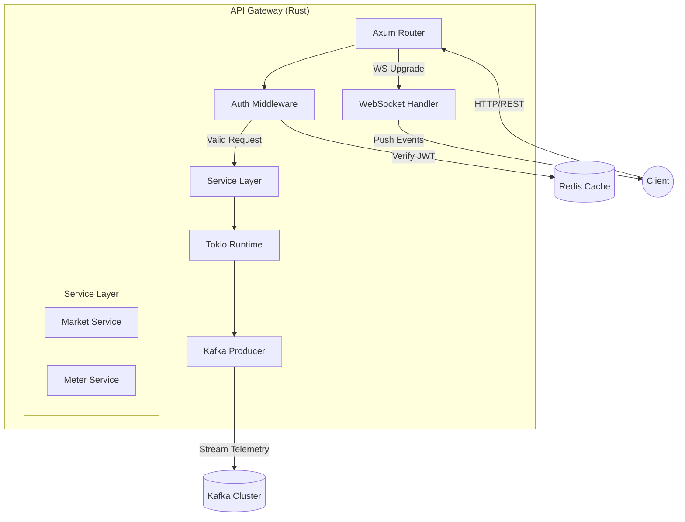

# System Architecture Design
## GridTokenX Platform

---

## 1. Introduction

**GridTokenX** transforms the energy grid into a programmable digital asset marketplace. It bridges the gap between **Physical Infrastructure** (Smart Meters, Solar Inverters) and **Digital Finance** (Solana Blockchain) using a robust, event-driven architecture.

---

## 2. Context Diagram (C4 Level 1)

**System Context**:
*   **Prosumers**: Households generating solar energy.
*   **Consumers**: Households/businesses buying energy.
*   **Grid Operator (DSO)**: Monitors stability and manages infrastructure.
*   **GridTokenX Platform**: The central hub facilitating telemetry and trade.
*   **Solana Blockchain**: The settlement layer.
*   **Payment Gateways**: Fiat on/off ramps (Stripe/PromptPay).

---

## 3. Container Diagram (C4 Level 2)

### 3.1 Key Containers

1.  **Frontend Single Page App (Next.js)**: The primary user interface.
2.  **API Gateway (Rust)**: REST/WebSocket entry point.
3.  **Authentication Service (JWT)**: Manages user sessions.
4.  **Telemetry Ingestion (Kafka)**: High-throughput buffer.
5.  **Smart Meter Simulator (Python)**: Generates physics-based data.
6.  **Trading Engine (Solana Program)**: On-chain order book.
7.  **Settle Service (Rust/Anchor)**: Off-chain worker triggering settlement.

---

## 4. Component Design: Frontend Layer

**Technology**: Next.js (React), TailwindCSS, Mapbox GL.

**Modules**:
*   **AuthContext**: Manages JWT lifecycle and Wallet connection.
*   **MarketDashboard**: Real-time order book visualization via WebSockets.
*   **EnergyGraph**: D3.js visualization of consumption vs. generation.
*   **WalletConnect**: Integration with Phantom/Solflare wallets.

---

## 5. Component Design: Backend Layer

**Technology**: Rust (Axum, Tokio).

### 5.1 API Gateway Internals (C4 Level 3)

The following diagram details the internal component interaction within the API Gateway, highlighting the non-blocking I/O model used for high-concurrency telemetry processing.

### 5.2 Storage Strategy
*   **PostgreSQL**: Identity, Relationship Mapping, Static Metadata.
*   **Redis**: Hot caching of latest meter readings, User Sessions, Pub/Sub.
*   **InfluxDB**: Time-series storage for historical energy data.

---

## 6. Component Design: Blockchain Layer

**Technology**: Solana (Anchor Framework).

### 6.1 Programs
1.  **Registry**: Manages user/meter identity PDAs.
    *   *PDA*: `find_program_address(["user", authority])`
2.  **Energy Token**: SPL Token-2022 implementation.
3.  **Trading**: On-chain order book for Continuous Double Auction (CDA).

### 6.2 Settlement Flow
1.  **Telemetry**: Meter reads 5kWh surplus.
2.  **Oracle**: API Gateway signs and verifies reading.
3.  **Minting**: Registry mints 5 GRID tokens to User's ATA.
4.  **Escrow**: User places sell order; 5 GRID locked in PDA.
5.  **Match**: Trading program matches order; atomic swap executes.

---

## 7. Component Design: Simulation Layer

**Technology**: Python (FastAPI, Pandapower).

**Logic**:
*   **Physics Engine**: Solves power flow equations (Newton-Raphson).
*   **Profiles**: Residential, Commercial, Industrial load curves.
*   **Weather**: Solar irradiance linked to simulated time of day.

---

## 8. Resilience & Reliability

### 8.1 Circuit Breakers
*   **Trading Halt**: Triggered if % price deviation > 10% in 1 minute.
*   **API Throttling**: Leaky bucket algorithm per IP.

### 8.2 Data Integrity
*   **Signed Readings**: Meters sign payloads with Ed25519 keys (simulated).
*   **Monotonicity Checks**: Registry rejects lower/older readings.

### 8.3 Scalability
*   **Stateless Services**: API Gateway scales horizontally behind Nginx.
*   **Partitioning**: Kafka partitions for telemetry sharding by Zone ID.

### 8.4 High Availability & Disaster Recovery (Phase 7)

**HA Strategy:**
*   **Kafka**: 3-node cluster with `min.insync.replicas=2` ensures zero data loss if one broker fails.
*   **Database**: PostgreSQL primary-replica setup with auto-failover (pg_auto_failover).
*   **API Gateway**: Deployed behind a Load Balancer (Nginx/AWS ALB) across multiple Availability Zones.

**Disaster Recovery (DR):**
*   **RPO (Recovery Point Objective)**: < 5 minutes (PostgreSQL WAL shipping).
*   **RTO (Recovery Time Objective)**: < 15 minutes (Container orchestration restart).
*   **Off-Site Backups**: Daily encrypted dumps to S3 Glacier.
*   **Solana State**: On-chain state is immutable; frontend simply re-indexes from RPC nodes.

---

## 9. Deployment Architecture (Phase 7 Stack)

** Orchestration**: Docker Compose (Local/Dev), Kubernetes (Prod - Roadmap).

**Service Map:**
1.  `gridtokenx-frontend`: Port 3000
2.  `gridtokenx-apigateway`: Port 8080 (Rust)
3.  `smartmeter-simulator`: Port 8000 (Python)
4.  `kafka`: Port 9092
5.  `postgres`: Port 5432
6.  `redis`: Port 6379
7.  `influxdb`: Port 8086
8.  `solana-test-validator`: Port 8899
9.  `prometheus`: Port 9090 (Observability)
10. `grafana`: Port 3001 (Dashboards)
11. `mailpit`: Port 8025 (Email Sandbox)

---

## 10. Key Equations & Logic

### 10.1 Energy Balance
$$ E_{net} = E_{gen} - E_{cons} $$
*   If $E_{net} > 0$: Mint $E_{net}$ GRID tokens.
*   If $E_{net} < 0$: Burn/Pay for $|E_{net}|$ GRID tokens.

### 10.2 Pricing Model (Dynamic)
$$ P_{t} = P_{base} \times (1 + \alpha \frac{D_t}{S_t}) $$
Where:
*   $P_t$: Price at time $t$
*   $D_t$: Aggregate Demand
*   $S_t$: Aggregate Supply
*   $\alpha$: Elasticity coefficient

---

## 11. Conclusion

The GridTokenX architecture represents a **system-of-systems** approach, carefully decoupling the high-frequency physical world (grid physics) from the high-security value layer (blockchain). By leveraging Rust for performance and Solana for speed, it achieves the latency required for a modern energy decentralization platform.
