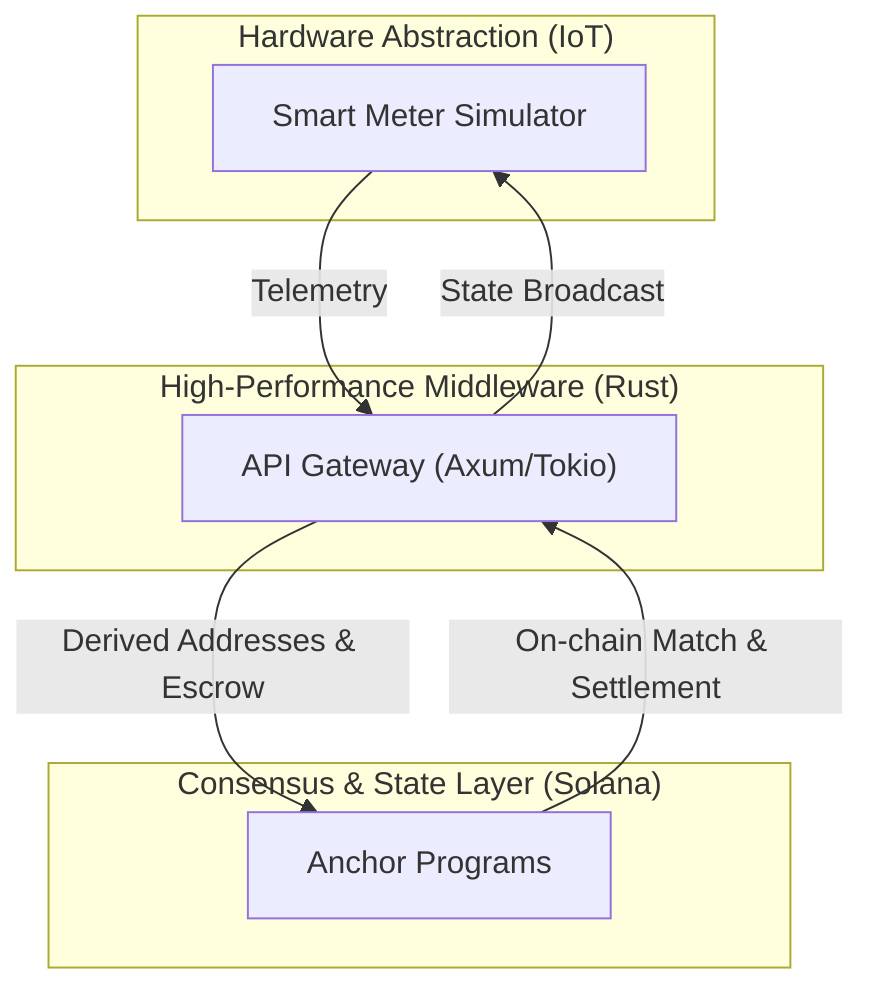

# GridTokenX: A Decentralized Peer-to-Peer Energy Exchange
**Mid-Term Project Presentation | Senior Computer Engineering Degree**

## 1. Introduction & Research Motivation (2 mins)
- **Context**: The shift toward Distributed Energy Resources (DERs) necessitates a localized trading infrastructure.
- **The Problem**: Current grids rely on "Net Metering" which lacks transparency and real-time market dynamics.
- **Our Solution**: A tri-layered architecture combining **Solana (Persistence)**, **Rust (Middleware)**, and **IoT Simulation (Edge)**.

## 2. Theoretical Architecture & System Design (3 mins)
*Engineering a high-performance, trustless middleware:*

## 3. Engineering Implementation Details (5 mins)

### A. Smart Contract & State Management (Anchor)
- **Registry & Identity**: Using Program Derived Addresses (PDAs) for deterministic identity mapping.
- **Security Validation**: Implementation of ownership verification and unauthorized settlement prevention (Formalized check of signing authorities).

### B. Scalable API Gateway & Trading Engine (Rust)
- **Concurrency Model**: Leveraging Tokio's multi-threaded runtime for asynchronous I/O.
- **P2P Matching Algorithm**: Implementing a "Landed Cost" sorting mechanism where candidates are ranked by `Base Price + Zonal Loss Factor + Wheeling Charges`.
- **Order Book Management**: High-performance in-memory matching cycle that bridges off-chain PostgreSQL state with on-chain Program Derived Addresses (PDAs).

### C. Transaction Lifecycle & Non-Repudiation
- **Transactional Integrity**: Solving the "Double-Spend" of energy by bridging database state with on-chain escrow locks.
- **Secure Order Flow**: 
    1. **Client Signature**: HMAC-SHA256 signing of order parameters for non-repudiation.
    2. **Escrow Lock**: Atomic locking of tokens/SOL on Solana upon order submission.
    3. **Atomic Settlement**: Multi-party transaction execution where energy tokens and currency are transferred simultaneously.

### D. Simulation Fidelity (Digital Twin)
- **Dynamic Load Balancing**: Simulating prosumer behavior using real-world generation/consumption curves.

## 4. Verification & Validation (3 mins)
- **Unit & Integration Testing**: 100% coverage of core business logic (16 scenarios).
- **Security Audit Simulation**: Intentional failure tests to validate constraint enforcement on the blockchain.
- **Environment**: Synchronous operation across Rust services and local Solana validator.

## 5. Demonstration Flow: "The Trustless Trade" (5 mins)
> [!IMPORTANT]
> **Key Demo Objectives:**
> 1. **Identity Provisioning**: Registering a meter and establishing its on-chain digital twin.
> 2. **Telemetry Ingestion**: Simulator pushing verified readings to the API Gateway.
> 3. **Market Operations**: Placing a P2P order and demonstrating the **Escrow Mechanism**.
> 4. **Settlement & Finality**: On-chain trade execution and token distribution.

## 6. Technical Engineering Challenges (2 mins)
- **State Reconciliation**: Managing the latency between off-chain order books and on-chain settlement.
- **Environment Parity**: Resolving ESM/CommonJS conflicts in the Solana SDK toolchain.

## 7. Future Research & Development (2 mins)
- **Matching Optimization**: Moving more matching logic on-chain (O(n) complexity analysis).
- **Geometric Zonal Pricing**: Integration of loss factors and wheeling charges into the matching engine.
- **Mobile Integration**: Consumer-facing real-time dashboard.