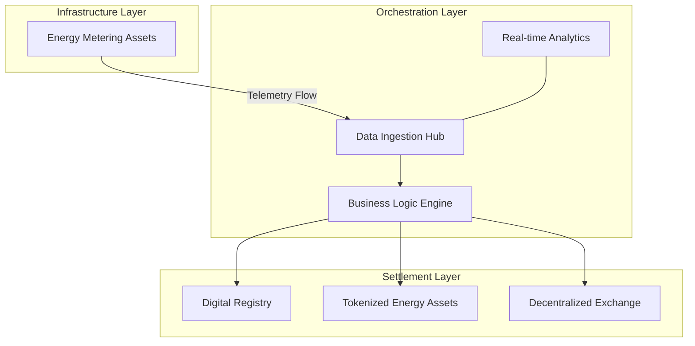
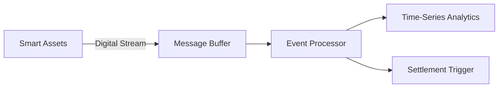
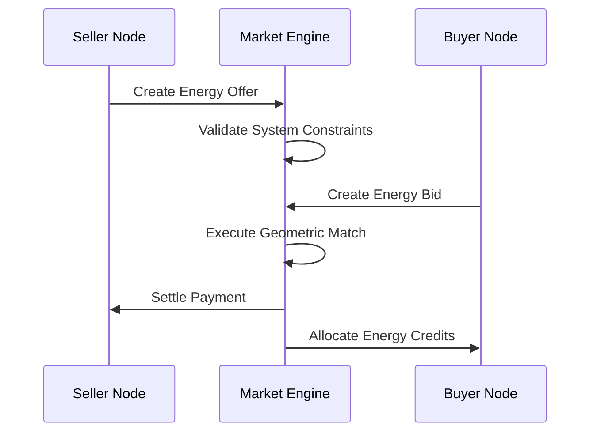
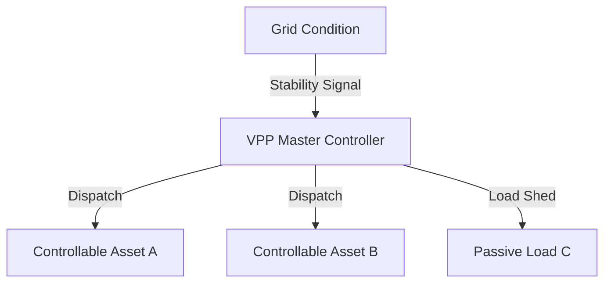

# GridTokenX: Core Design Architecture (CDA)

This document outlines the high-level architecture of the GridTokenX platform, focusing on the structural relationships between physical energy layers and decentralized value systems.

---

## 1. System Macro-Architecture
*Structural overview of the end-to-end data and value flow.*

---

## 2. Telemetry & Ingestion Design
*The architectural strategy for handling high-frequency physical grid data.*

---

## 3. Decentralized Market Flow
*The core architectural loop for peer-to-peer energy matching.*

---

## 4. Virtual Power Plant (VPP) Control Plane
*Architectural design for aggregate grid balancing.*

---

## Summary of Architectural Components

| Component | Responsibility |
|-----------|----------------|
| **Infrastructure** | Physical data generation and secure device identity. |
| **Orchestration** | Event sourcing, buffer management, and grid logic. |
| **Settlement** | Immutable ledger for ownership and atomic value transfer. |
| **Control Plane** | Real-time aggregate resource optimization. |
