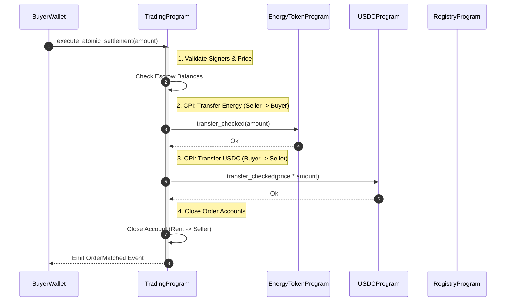
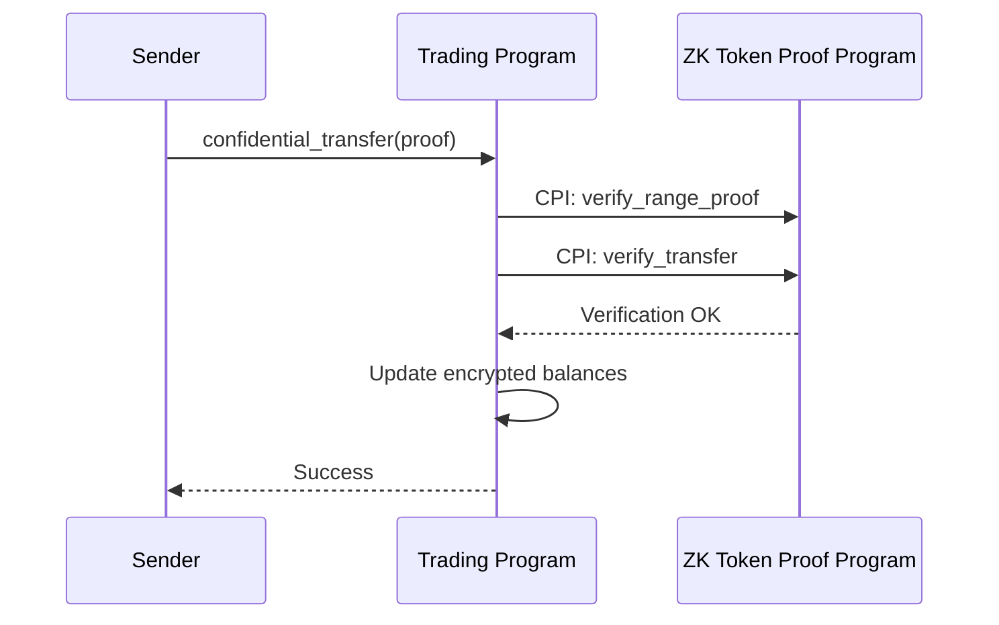

# Smart Contract Design and Implementation
## GridTokenX Platform — Technical Deep-Dive

This document is the **master reference** for Solana program design, instructions, PDAs, account layouts, events, and security.

---

## 1. Overview

GridTokenX implements a suite of **Solana-native smart contracts** (Programs) using the **Anchor framework**. The programs enforce trustless P2P energy trading, digital identity management, and renewable energy certification.

---

## 2. Program Architecture

### 2.1 Program Inventory

| Program | Env | Default (localnet) | Purpose |
|---------|-----|--------------------|---------|
| **Registry** | `REGISTRY_PROGRAM_ID` | `3aF9FmyFuGzg4i1TCyySLQM1zWK8UUQyFALxo2f236ye` | User/Meter identity management |
| **Trading** | `TRADING_PROGRAM_ID` | `GTuRUUwCfvmqW7knqQtzQLMCy61p4UKUrdT5ssVgZbat` | P2P energy marketplace |
| **Energy Token** | `ENERGY_TOKEN_PROGRAM_ID` | `8jTDw36yCQyYdr9hTtve5D5bFuQdaJ6f3WbdM4iGPHuq` | GRID token (SPL Token-2022) |
| **Oracle** | `ORACLE_PROGRAM_ID` | `ACeKwdMK1sma3EPnxy7bvgC5yMwy8tg7ZUJvaogC9YfR` | Meter reading validation |
| **Governance** | `GOVERNANCE_PROGRAM_ID` | `51d3SDcs5coxkiwvcjMzPrKeajTPF9yikw66WezipTva` | RECs |

### 2.2 Atomic Settlement Sequence

The following sequence diagram details the `execute_atomic_settlement` instruction flow, illustrating the Cross-Program Invocations (CPI) required to swap assets trustlessly.



### 2.3 Cross-Program Invocation (CPI) Reference

To maintain composability, here is the reference for key CPI signatures.

#### Explicit CPI Context Construction
When the **Trading Program** transfers energy tokens from an escrow PDA, it must sign using `signer_seeds`.

```rust
// Inside execute_atomic_settlement
pub fn transfer_energy_tokens<'info>(
    ctx: &Context<'_, '_, '_, 'info, ExecuteSettlement<'info>>,
    amount: u64,
) -> Result<()> {
    // 1. Define accounts expected by SPL Token Program
    let cpi_accounts = TransferChecked {
        from: ctx.accounts.seller_energy_account.to_account_info(),
        mint: ctx.accounts.energy_mint.to_account_info(),
        to: ctx.accounts.buyer_energy_account.to_account_info(),
        authority: ctx.accounts.market_pda.to_account_info(), // PDA Signer
    };
    
    // 2. Derive PDA seeds for signing
    let market_bump = ctx.bumps.market_pda;
    let seeds = &[
        b"market".as_ref(),
        &[market_bump],
    ];
    let signer_seeds = &[&seeds[..]];

    // 3. Create Context with Signer
    let cpi_ctx = CpiContext::new_with_signer(
        ctx.accounts.token_program.to_account_info(),
        cpi_accounts,
        signer_seeds
    );

    // 4. Invoke SPL Token Instruction
    token_interface::transfer_checked(cpi_ctx, amount, 9)?;
    
    Ok(())
}
```

---

## 3. Registry Program (Identity Layer)

**Purpose**: Manages deterministic mapping between users/meters and blockchain accounts.

### 3.1 Registry State

#### `register_user`
*   Creates a `UserAccount` tied to a wallet.
*   **PDA**: `[b"user", user_pubkey]`
*   **Allocated Space**: 8 (discriminator) + 32 + 1 + 8 + 8 + 1 + 8 + 4 = **70 bytes**.

#### `register_meter`
*   Links a smart meter.
*   **PDA**: `[b"meter", meter_id.as_bytes()]`
*   **Zero-Copy**: Uses `AccountLoader` to support large history buffers if needed.

---

## 4. Trading Program (Marketplace Layer)

**Purpose**: Implements a trustless order book for P2P energy trading.

### 4.1 Instruction Data Layout

Instruction args are serialized as **Little-Endian**.

| Instruction | Discriminator (8 bytes) | Arguments |
|-------------|-------------------------|-----------|
| `initialize_market` | `[35, 35, 189, 193, 155, 48, 170, 203]` | (none) |
| `create_sell_order` | `[53, 52, 255, 44, 191, 74, 171, 225]` | `amount` (u64), `price` (u64) |
| `match_orders` | `[17, 1, 201, 93, 7, 51, 251, 134]` | `match_amount` (u64) |

### 4.2 Error Handling & Recovery

**Common Error Codes:**

| Code | Name | Cause | Recovery Action |
|------|------|-------|-----------------|
| `6000` | `Unauthorized` | Signer != Owner | Check wallet connection |
| `6002` | `InsufficientFunds` | Token balance < Order amount | User must deposit more GRID/USDC |
| `6005` | `SlippageExceeded` | Price moved > 5% during match | Frontend auto-retries with new price |
| `6009` | `OracleStale` | Meter reading > 1h old | Admin triggers `force_sync` |

**Atomic Rollback**:
If any step in the sequence diagram (Token Transfer, Payment, State Update) fails, the Solana runtime **reverts the entire transaction**. This guarantees no partial states (e.g., Buyer pays but receives no energy).

---

## 5. Security Model

### 5.1 Upgrade Strategy (Squads Multisig)

All programs are deployed as **Upgradeable** but controlled by a 3-of-5 Multisig.

**Upgrade Workflow:**
1.  **Proposal**: Dev submits new buffer address `BufferKey`.
2.  **Verification**: 3 Signers review the diff (`solana program dump`).
3.  **Approval**: Signers approve the `ProgramUpgrade` transaction.
4.  **Execution**: The multisig executes the upgrade instruction.

```rust
// Squads Configuration
const MULTISIG_THRESHOLD: u8 = 3;
const TIME_LOCK: i64 = 48 * 3600; // 48 hours for Registry upgrades
```

---

## 7. Confidential Trading (ZK Proofs)

The Trading Program supports **confidential transfers** using Zero-Knowledge proofs via Solana's ZK Token SDK. This enables private energy trading where transaction amounts remain hidden while still being verifiable on-chain.

### 7.1 Cryptographic Primitives

| Primitive | Implementation | Purpose |
|-----------|----------------|---------|
| **ElGamal Encryption** | `WrappedElGamalCiphertext` | Encrypt token balances (64-byte ciphertext) |
| **Pedersen Commitment** | `WrappedPedersenCommitment` | Commit to values without revealing them (32-byte) |
| **Range Proof** | `RangeProofU64Data` | Prove value is in range [0, 2^64) without revealing it |
| **Transfer Proof** | `TransferData` | Prove balance conservation during confidential transfer |

### 7.2 Confidential Transfer Flow



### 7.3 Module Structure

```
trading/src/
├── zk_proofs.rs        # ZK primitives, proof wrappers
├── confidential_ops.rs # Shield/Unshield/Transfer operations
└── confidential.rs     # Instruction handlers for confidential trading
```

---

## 8. Performance Characteristics

### 8.1 Compute Budget Analysis

| Instruction | Compute Units (CU) | % of Limit (200k) |
|-------------|--------------------|-------------------|
| `register_user` | 5,200 | 2.6% |
| `create_order` | 18,000 | 9.0% |
| `match_orders` | 35,200 | 17.6% |
| `settle_batch` | 140,000 | 70.0% |

**Optimization**:
`match_orders` is optimized by passing `AccountLoader` (Zero-Copy) for the Market state, avoiding the 10MB heap limit deser cost for the order book vector.
