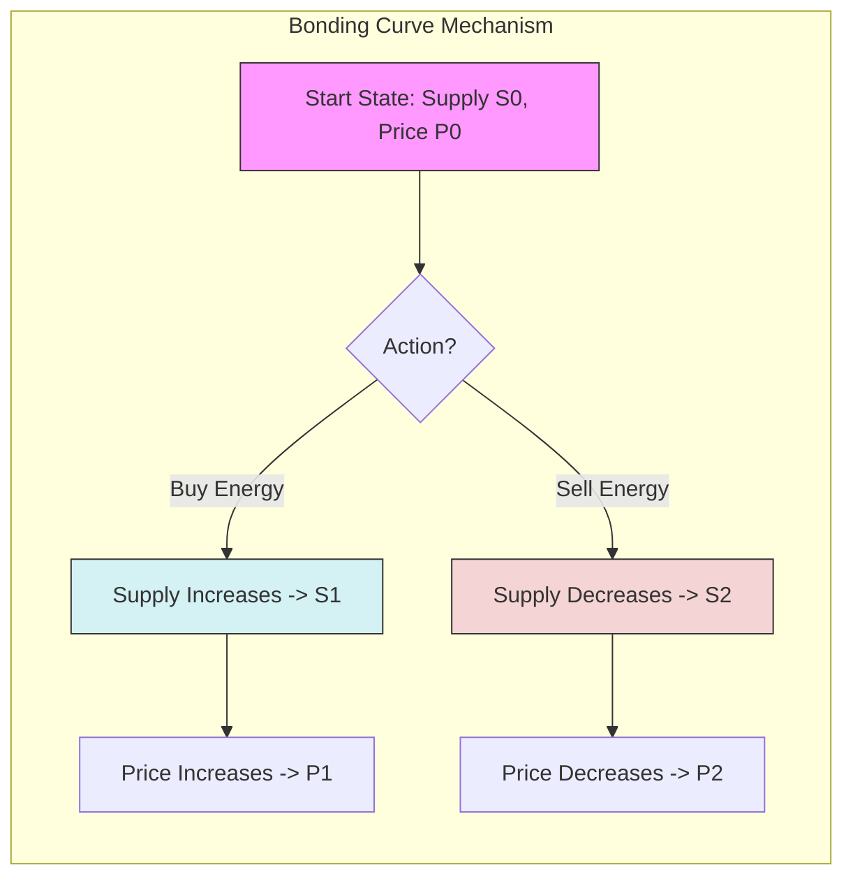

# Tokenomics and Pricing Model
## GridTokenX Platform

---

## 1. Executive Summary

The **GridTokenX Tokenomics Model** is designed to incentivize the generation of renewable energy while ensuring fair and efficient market clearing. It employs a **dual-token system** (Energy Token + Stablecoin) and dynamic pricing mechanisms to balance grid supply and demand.

**Core Philosophy**: Energy is a tangible asset; the token model must reflect physical reality (generation/consumption) rather than speculative value.

---

## 2. Token Definitions

### 2.1 GRID Token (Energy Asset)
*   **Type**: SPL Token-2022 (Solana).
*   **Role**: Represents verified energy verification (1 GRID = 1 kWh).
*   **Minting**: Algorithmic minting upon Oracle verification of smart meter surplus.
*   **Burning**: Burned/Settled when consumed or traded for stablecoins.
*   **Supply**: Elastic; expands with solar generation, contracts with consumption.

### 2.2 Payment Token (USDC/SOL)
*   **Type**: SPL Token (Stablecoin).
*   **Role**: Medium of exchange for purchasing energy.
*   **Stability**: Ensures predictable pricing for consumers.

---

## 3. Pricing Mechanisms

### 3.1 Base Price Model (Time-of-Use)
The baseline price ($P_{base}$) is determined by the grid operator's Time-of-Use (TOU) tariff structure.

| Period | Time | Multiplier | Rationale |
|--------|------|------------|-----------|
| **Off-Peak** | 22:00 - 09:00 | 1.0x | Low demand, encourages EV charging. |
| **Shoulder** | 09:00 - 14:00 | 1.2x | Moderate demand, high solar availability. |
| **Peak** | 14:00 - 22:00 | 2.5x | Grid strain, incentivizes discharge/conservation. |

### 3.2 Dynamic Market Price (P2P)
The P2P market price ($P_{mkt}$) floats freely but is influenced by the **Demand/Supply Ratio ($R_{ds}$)**.

$$ R_{ds} = \frac{\text{Total Buy Volume}}{\text{Total Sell Volume}} $$

$$ P_{mkt} = P_{base} \times (1 + \alpha \cdot \log_{10}(R_{ds})) $$

*   $\alpha$: Sensitivity coefficient (default: 0.2).
*   Ideally, $P_{mkt}$ stays within $\pm 20\%$ of $P_{base}$ to prevent volatility.

---

## 4. Market Structure

### 4.1 Order Book (Primary Market)
*   **Mechanism**: On-chain Limit Order Book (CLOB).
*   **Matching**: Double Auction (buyers want low, sellers want high).
*   **Clearing**: Best execution price.

### 4.2 Automated Market Maker (AMM - Secondary Market)
To ensure liquidity during low-volume periods, the platform implements an AMM pool.

#### Bonding Curve Visualization
The following diagram illustrates how the price adjusts to supply changes (Buy Pressure vs. Sell Pressure).



---

## 5. Detailed AMM Mathematics

We utilize a **Constant Product** formula with a **Bonding Curve** adaptation for infinite liquidity of the Energy Token (which has elastic supply).

### 5.1 Linear Bonding Curve
The price of the token $P(S)$ is a linear function of the current circulating supply $S$.

$$ P(S) = m \cdot S + b $$

Where:
*   $m$: Slope (price sensitivity, e.g., $0.000001$ USDC per kWh squared).
*   $b$: Initial price intercept (e.g., $0.50$ USDC).

### 5.2 Reserve Pool Accumulation (Integral)
The total value locked ($R$) in the reserve pool for a given supply ($S$) represents the area under the price curve. This ensures that every token minted is fully backed by the accumulated reserves.

$$ R = \int_{0}^{S} P(x) \, dx = \int_{0}^{S} (m \cdot x + b) \, dx = \frac{1}{2} m S^2 + b S $$

*   **Minting Cost**: To mint $\Delta S$ tokens (Buy), user pays $R(S + \Delta S) - R(S)$.
*   **Burning Reward**: To burn $\Delta S$ tokens (Sell), user receives $R(S) - R(S - \Delta S)$.

### 5.3 On-Chain Implementation (Rust)
To maintain beneficial precision without floating points, we use **fixed-point arithmetic** (u128) in the smart contract.

**Price Impact Logic:**
```rust
pub fn calculate_price_impact(
    current_supply: u128,
    order_amount: u64,
    curve_slope: u64,
    base_price: u64,
) -> Result<u64> {
    // Formula: Impact = (PriceDelta / OldPrice) * 10,000 basis points
    
    // 1. Calculate Old Price
    let old_price = current_supply
        .checked_mul(curve_slope as u128).unwrap()
        .checked_add(base_price as u128).unwrap();
        
    // 2. Calculate Next Supply
    let next_supply = current_supply
        .checked_add(order_amount as u128).unwrap();
        
    // 3. Calculate New Price
    let new_price = next_supply
        .checked_mul(curve_slope as u128).unwrap()
        .checked_add(base_price as u128).unwrap();
    
    // 4. Calculate Delta and Basis Points
    let price_delta = new_price.saturating_sub(old_price);
    
    let impact_bps = price_delta
        .checked_mul(10000).unwrap()
        .checked_div(old_price).unwrap_or(0);
        
    Ok(impact_bps as u64)
}
```

**Price Impact protection**:
Trades exceeding **5% (500 bps)** slippage are rejected by the frontend circuit breaker to protect users from high volatility.

---

## 6. Economic Incentives & Fees

### 6.1 Transaction Fee
*   **Rate**: 25 basis points (0.25%).
*   **Payer**: Taker (Buyer).
*   **Distribution**:
    *   40% -> Grid Maintenance Fund (DSO).
    *   40% -> Platform Development (Treasury).
    *   20% -> Insurance Fund (Default protection).

### 6.2 Recursive Incentives (REC)
Producers generating "Green" energy (Solar) receive separate **Renewable Energy Certificates (RECs)** standardizing their contribution to carbon reduction. These are separate NFT assets tradable on carbon markets.

---

## 7. Economic Stress Testing

To validate the robustness of the model, we simulate extreme market conditions.

### 7.1 Scenario A: Flash Crash (Solar Surplus)
**Event**: Sunny Sunday afternoon; industrial demand drops, solar generation peaks.
*   **Input**: Supply rises 300%, Demand drops 50%.
*   **Model Reaction**:
    *   $R_{ds}$ crashes to 0.16.
    *   $P_{mkt}$ drops to $0.85 \times P_{base}$.
    *   **Result**: Low prices incentivize battery storage systems to absorb cheap energy.

### 7.2 Scenario B: Hyper-Inflation (Grid Failure)
**Event**: Major power plant outage; grid reliance on microgrids spikes.
*   **Input**: Supply drops 80%, Demand constant.
*   **Model Reaction**:
    *   $R_{ds}$ spikes to 5.0.
    *   $P_{mkt}$ hits cap (e.g., $3.0 \times P_{base}$).
    *   **Circuit Breaker**: Trading halts if price exceeds regulatory ceiling, forcing manual load shedding.

### 7.3 Scenario C: Grid Collapse (Liquidity Crisis)
**Event**: Network partition; no new buy orders.
*   **Input**: Buy Volume = 0.
*   **Model Reaction**:
    *   Order book freezes.
    *   **Fallback**: AMM pool provides "buyer of last resort" at steep discount (-50%), allowing desperate sellers to exit.

---

## 8. Conclusion

The GridTokenX economic model balances **free-market dynamics** with **grid stability** requirements. By anchoring token supply to physical generation and using elasticity-based formulae, it avoids the "ponzi" mechanics of pure DeFi tokens while providing liquidity and fair compensation to prosumers.
